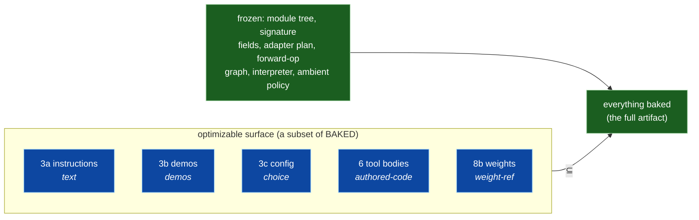
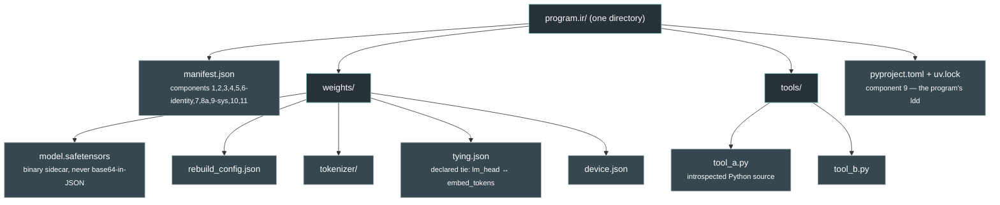
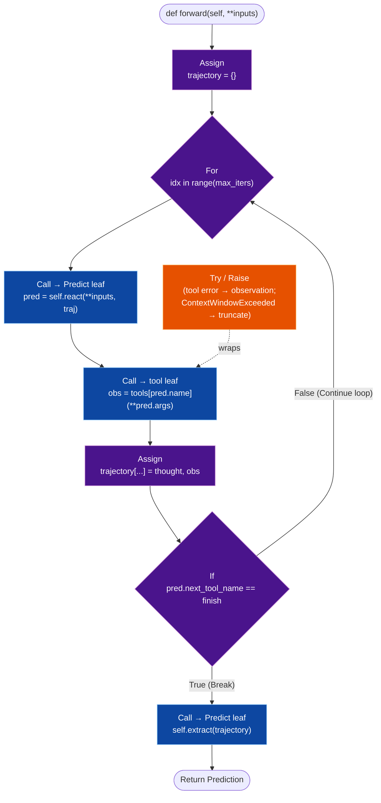

# The `ProgramIR` — a program-level IR specification

**Status:** specification (no implementation). Grounds every field in real dspy
symbols at `file:line`. Source tree read: `recover-engine` (branch
`adapter-engine/qc-03`); worktree context `chat-compat-lm`. Companion to
`roadmap/DESIGN-program-artifact.md` (compiler/linker framing),
`roadmap/IR-field-spec.md` (the 17-field derived inventory), and
`reports/DESIGN-REVIEW-portable-programs.md` (the executed shortfalls).

This spec is the **ideal representation**, not the incremental sidecar. Where
`IR-field-spec.md` mines "what today's save must additionally grab," this spec
starts from the *fully-baked, single-process, in-RAM* reference frame of the
DESIGN doc and asks: what is the one object that fully *is* the program? It is
fine if dspy needs major work to support it.

---

## (a) Thesis

**A DSPy program is one `ProgramIR` value: a plain, structured record that bakes
everything the program's behavior depends on — module tree, signatures,
instructions, demos (with input/label designation), resolved predictor config,
the adapter as a reified `AdapterPlan` + transforms + parser hooks (+ a
format/literal-table concept the engine must still grow), a
forward-op graph over a small fixed operator set, tools as structured identity +
Python source + declared deps, an in-process code interpreter, and the LM as the
`typed_lm` contract plus a baked safetensors weight slot — assembled entirely
from standard components (a JSON manifest, safetensors tensor bytes, typed JSON
schemas, and introspectable Python source) so that it survives a full serde
roundtrip, reconstructs to a behaviorally-equivalent program with *zero*
reach-back into ambient `dspy.settings`, and exposes every piece as something a
future dspy in another language can adopt à la carte.** Only credentials are
never baked; only the genuinely-external axes are declared. Everything else the
program *learned or resolved* is inside the file.

### Working examples — where they live and how to read them

This spec is validated by **15 `ProgramIR` examples that run on real
hardware** (12 hand-authored; 13–15 machine-compiled) (a 321M model, PleIAs/Baguettotron, for the baked-LM examples;
real served models for the declared-LM ones). They are **not in this repo** —
they live on the compute server at **`~/docmaker/examples-build/`** (maxime@
192.168.2.24), because the rung-0 ones carry ~1.2 GB of baked weights each
(the declared-tier ones are a few hundred KiB — the trade made visible). Start
there with **`examples-build/README.md`**, which maps every example (01–15) to
the spec part it proves, how to run it, how to add a new one, and the gotchas.
The `explain` reader (`examples-build/explain/explain.py`) prints any artifact
as a legible IR (View 1) without loading weights. Each example's `load.py`
proves the save→send→same-behavior roundtrip. Quick index of what each proves:
01–04 adapters (incl. authored-source custom adapter); 05 the
prompt-optimization *mechanism* (View 3 — its headline number is
train/test-leaky, see §e1 caveat); 06 the GPU device slot (§e0); 07
weight-training the `weight-ref` field (View 3, real HF data); 08 the vLLM
in-process engine + batching (§e0-engine); 09 the **declared LM tier** at the
`http_local` rung (packaged LM class, endpoint/credential as receiver
bindings, load-time verification with loud refusal — §e0-binding); 10 the
outermost `http_remote` rung against a hosted provider, including the
**same-artifact cross-provider re-bind** (§e0-binding's payoff, proven); 11
the first **multi-predictor module** — two Predicts, per-predictor adapters
AND per-predictor declared LMs at mixed rungs, a value threading between
stages — the example that forced the pool shape (§b-pools; its own manifest
still uses the transitional per-predictor map form); 12 the **pool-form
proof**: two predictors sharing one baked LM entry, all three weight regimes
(joint / fork / shared-base+LoRA) exercised as asserted hash facts through
the §c1 store, base ⊕ delta reconstructed bit-for-bit; 13 the first
**compile→serialize→link→interpret pipeline** (§d proven): real nested module
classes compiled by `ast.parse` + whitelist, the baked AST interpreted at
load with no source import, both refusal classes fired, traces identical; 14
the **ReAct shape compiled** — For/Break/Try/Raise/BinOp + dynamic tool
leaves, component-6 tools as baked identity-verified source (first exercise),
and the structural equivalence criterion for declared-LM agents; 15 the
**all-rung-0 RLM** — component 7 (in-process interpreter) first exercised,
`While` closing the §d whitelist, generated code as data, bit-for-bit with
the network blocked: the fully-baked pole (the thesis' reference frame)
realized for the hardest module family.

---

## (b) The `ProgramIR` field table

Legend — **tier:** `bake` (in the artifact, resolved at save) · `declare`
(required capability, verified at load, refused loudly) · `credential` (never
baked). **optimizable-kind:** `frozen` · `text` · `demos` · `choice` ·
`weight-ref` · `authored-code` · `structure` (tree/AST rewrites within the §d
grammar — the limit-case kind, §e2).

| # | component | representation | plain-data format | optimizable-kind | tier |
|---|---|---|---|---|---|
| 1 | **module tree** | ordered tree of nodes, each `{kind, name, children, forward_ref}`; the tree *is* the recursion — a parent's forward calls child modules as leaves, bottoming out at Predict/UDF (§d). Each Predict leaf additionally carries **bindings** `{adapter: pool-ref, lm: pool-ref, delta?: blob-ref}` naming its entries in the component pools (§b-pools) | JSON | frozen (structure) | bake |
| 2 | **signature** | per predictor: ordered `fields[]` each `{name, direction(input/output), prefix, description, shape, semantic_role}` — `direction` is the renamed old `role` key; **`shape`** is the field's data type as JSON schema (*arbitrary* Python/pydantic typing — no blessed type list; hints with no JSON-schema meaning, e.g. `Callable`, refuse loudly: those are tools, not data); **`semantic_role`** is the field's relationship to the exchange, a closed versioned vocabulary (`plain \| reasoning \| tools \| tool_calls \| citations \| history \| media \| code`) — intent, hence frozen: "I want cited answers" defines the task; *how* citations are obtained is a component-4 strategy (§Adapter-semantics). **Instructions are NOT stored here** — they live once in 3a (see note) | JSON (mirrors `Signature.dump_state()`, `signature.py:495`, minus instructions) | frozen | bake |
| 3a | **instructions** | the signature instruction text, resolved — the **single canonical home** for instructions; component 2 does not duplicate it | JSON string | **text** | bake |
| 3b | **demos** | `list[demo]`, each carrying its field values **and** its input/label designation (`_input_keys`) as an explicit `input_keys[]` list — the fix for §8 | JSON | **demos** | bake |
| 3c | **predictor config** | resolved `{temperature, n, max_tokens, top_p, stop, …}` — the `Predict.config` dict (`predict.py:61`) that `dump_state` drops; baked here as an `LMConfig` (`types.py:469`) | JSON | **choice** | bake |
| 4 | **adapter** | a **pool of named entries** (§b-pools) — predictors bind an entry by name; a one-adapter program is a one-entry pool. Each entry: reified `AdapterPlan` (`_engine/ir.py:41`): `RenderField[]` input/output layer, `field_transforms[]` (Hide/Rename/Add × Input/Output, `transforms.py`), `parsers[]` (ParserHook identities, `parser_hook.py:76`), `format_identity` + `literal_table` (**fixed key vocabulary**, §Adapter-notes), and an optional `config` block for resolved capability-checked flags (JSONAdapter's `response_format_routing` etc.), a **`strategies` block** (per semantic role, a named strategy binding — capability-checked at bake, provenance-traced; §Adapter-semantics), and **codec bindings** (`input_codec`/`output_codec` per field shape, drawn from a named **codec pool**; §Adapter-semantics). Format layer is **required but not yet in this branch** | JSON (operator refs + fixed literal table + strategies + codecs + config) | frozen (plan/transforms/parsers) / **choice** (`output_structure`; binding's entry selection; strategy + codec bindings) / **text** (literal-table values) — see §Adapter-notes tag split | bake |
| 5 | **forward (restricted-Python AST)** | per module: the `forward` AST restricted to a whitelist of node kinds (`if`/`for`/`while`/`try`/`raise`/assign) whose `Call`s resolve to declared typed leaves (Predict / sub-module / tool / interpreter); recurses via sub-module leaves (§d) | JSON (AST) | frozen | bake |
| 6 | **tools** | per tool: identity `{name, parameters(arg JSON schema)}` = `LMToolSpec` (`types.py:292`) **plus net-new** `return_schema` + `source` (Python source) + `deps[]` + a `placement` block (§e0: rung 0 = in-process source → local service → **MCP**/remote microservice) (see §Tool-notes) | JSON identity + Python source string | frozen (identity) / **authored-code** (body) | bake at rung 0 / declare beyond |
| 7 | **interpreter** | `{kind, module_name}` + a baked **identity profile** — the semantics the program's scores are claims about: `{language+version, namespace_policy, packages[], resource_limits, result_convention}` (§e0-binding: the interpreter is the third instance of identity-vs-binding) — + a `placement` block (§e0). Rung 0 = generated code in an isolated namespace / synthetic module in the *same* process (**no Deno declared**); outward rungs = same-sandbox subprocess → separate sandbox → remote pool. Placement is the receiver's; the profile is not — changing it is a recorded deviation. Fully net-new (see §Interpreter-notes) | JSON | frozen | bake at rung 0 / declare beyond |
| 8a | **LM contract + class + engine** | a **pool of named entries** (§b-pools) — predictors bind an entry by name, and *sharing an entry is semantic, not cosmetic*: bindings declare which forwards run (and train) the same model. Each entry: `forward_contract = "typed_lm"` (`base_lm.py:69,163`): `forward(LMRequest)->LMResponse` (`types.py:623,808`); an `lm.class` block `{identity, origin: packaged\|authored, source?, deps[]}` (see §e0-class); **plus an `engine` field** `{transformers \| vllm-offline \| …}` — the in-process implementation, orthogonal to placement rung and class origin (see §e0-engine). A **declared** (past-rung-0) LM additionally bakes `weights_identity` — the canonical weight identity its scores are claims about — plus a `served_aliases[]` evidence hint; the endpoint and served name are receiver bindings, not baked values (§e0-binding). Builtin `dspy.LM` needs no class block | JSON marker (+ Python source if authored) | frozen (contract) / **authored-code** (if authored) | **declare** (packaged) / **bake** (authored) |
| 8b | **LM weights slot** | per LM-pool entry: safetensors tensor bytes (binary sidecar) + rebuild config + tokenizer files + tied-tensor policy + `device` + a `placement` block (§e0: rung 0 = weights baked in-process → local RPC → HTTP local → HTTP remote provider) — see §Weights-slot; proven on Baguettotron (321M). A predictor's *effective* weights are the entry's **base ⊕ its binding's optional `delta`** (§b-pools) — the delta is a small per-binding blob (LoRA-style), itself a `weight-ref` field | safetensors + JSON | **weight-ref** (base and/or delta; either may be tagged frozen) | bake at rung 0 / declare beyond |
| 9 | **environment manifest** | a **PEP 723 inline-metadata block** (`# /// script … ///`) on the program's entry/loader file — `dependencies`, `requires-python`, `[[tool.uv.index]]`, optional `exclude-newer` — plus the `uv lock --script`-produced `<entry>.lock`; `system_deps[]` for non-Python needs. Receiver runs `uv run --script` (or `uv sync` from the lock). See §Env-manifest | PEP 723 comment block + `.lock` | frozen | bake (deps) / declare (system) |
| 10 | **credentials** | declared only: `{name, scope}` records of what the target must supply; **NEVER a value** | JSON (names only) | n/a | **credential** |
| 11 | **ambient policy** | resolved `{max_errors, async_max_workers, allow_tool_async_sync_conversion}` that shaped evaluated behavior. *Annotated IOU: this is harness policy awaiting structure — per-node error policy, when it matters (it will, for agents), becomes an error-policy lowering into component-5 `Try` flow (§d-lowering), retiring the ambient flag* | JSON | frozen | bake |
| 12 | **metric** (train/dev object) | `metric(example, prediction)→score` as a tool-shaped leaf: identity + Python `source` + `deps[]` + `placement` (§e0: rung 0 = baked pure-Python; outward = declared judge-LM / eval service). Enables View-3 scoring + re-scorable-anywhere (§e1). Droppable in the ship object | JSON identity + Python source | frozen (identity) / authored-code (body) | bake at rung 0 / declare beyond |

Structure/baked ≈ 8 components · declared = LM identity + system deps · credential = 1. The
artifact is mostly whole — as `IR-decisions.md` recommends: *bake the
learned+resolved program; declare the irreducibly-external; never bake secrets.*

**Instructions have exactly one home (3a), by design.** dspy's `dump_state`
nests instructions inside the signature, so a naïve IR would store the same text
in both component 2 and 3a — and if an optimizer rewrites 3a while a stale copy
sits in 2, "which wins" is undefined. Because instructions are **optimizable**
(the `text` kind — the field MIPRO/GEPA most often rewrite) and component 2 is
**frozen**, they cannot live in a frozen component: the single mutable copy is
3a, and component 2 stores only the frozen field list. Any renderer/loader reads
instructions from 3a alone. (Surfaced by the `explain` reader finding the two
copies identical with no tie-breaker specified.)

<a name="b-pools"></a>
### The manifest's shape — component pools, tree bindings, and base ⊕ delta

A single-predictor program never forces the question of how components attach
to predictors; a multi-predictor one does (example 11: two Predicts, each
needing its *own* adapter and its *own* LM — a program dspy's one-slot ambient
`settings.adapter`/`settings.lm` cannot even express). The manifest resolves
it with a relational shape, chosen over two rejected alternatives (below):

- **Identity-bearing, shareable components live in named pools.** Adapters
  (4) and LMs (8a/8b) become top-level maps `{entry_name → entry}`; tools
  (6), the interpreter (7), and the metric (12) already are pools. An entry
  is declared **once**, whatever the number of predictors using it.
- **Per-predictor learned state stays keyed by predictor path.** Signature
  (2), instructions (3a), demos (3b), and config (3c) are maps keyed by the
  module tree's predictor paths (`draft`, `polish`, dotted for nesting) —
  these are never shared by definition (an instruction *is* one predictor's
  instruction), so they need no pool.
- **The module tree carries the bindings.** Each Predict leaf names its
  entries: `{adapter: "terse", lm: "baguettotron", delta?: <blob-ref>}`. The
  tree is the *use-site table*; the pools are the *symbol table* — and load
  is the **link step**: every binding must resolve to a declared entry, and a
  dangling binding is a link error refused loudly at load, exactly the
  §16-class failure (Flex's tool names dangling after reload) made
  structurally impossible.

One shape, no special cases: a single-predictor program is a one-entry pool
with one binding — there is no separate "simple form" for readers to also
support. And the shape is **congruent with the storage model**: §c1's
content-addressed serialization *is* pools-plus-references with hashes as
names, so the human-readable manifest and its checkpoint store are the same
design at two levels of naming.

**Rejected alternatives, for the record.** *Component-major per-predictor
maps* (each of 2/3/4/8 becomes `{predictor → value}`, the shape example 11's
transitional manifest uses) keeps component numbering but scatters one
predictor's definition across six maps, duplicates every shared entry per
predictor, and — decisively — misrepresents sharing: five predictors over one
LM serialize as five LM blocks, implying five independently trainable models
when mutating one in fact mutates all (the shared-weights hazard below).
*Predictor-major nesting* (each tree node carries its components inline) has
good locality but the same fatal duplication, and buries the component axis
the tier/optimizable machinery is stated over. The pool shape is the only one
of the three where **sharing is a fact the artifact states** rather than a
coincidence the reader must infer from repeated content.

**Base ⊕ delta: what training means against shared entries.** Sharing an LM
entry is a *training* statement, not a storage one: gradients from every
bound predictor's calls flow into the same tensors. The rule that makes every
regime expressible is: **a predictor's effective weights are its entry's base
weights ⊕ its binding's optional delta** (a small LoRA-style blob riding on
the binding). Base and delta each carry their own frozen/`weight-ref` tag, so
a training regime is nothing but a *binding topology plus a tag pattern*:

| regime | topology | tags | a train step changes |
|---|---|---|---|
| **joint fine-tune** (one model, loss from all N stages) | N bindings → 1 entry, no deltas | base `weight-ref` | the one base blob — all N stages feel it |
| **forked fine-tunes** (N specialized models) | N bindings → N entries | each base `weight-ref` | that stage's base blob only |
| **shared base + LoRA** (specialization without duplication) | N bindings → 1 entry, N deltas | base **frozen**, deltas `weight-ref` | that stage's small delta; the base hash never moves |

`optimizable ⊆ baked` holds unchanged in all three — everything trainable is
a baked, hashed blob. Under §c1 the economics follow: a joint step re-hashes
one large blob; a LoRA step re-hashes one small blob; and a **fork is free at
birth** (two entry names, one hash) with the blobs diverging only when
training actually separates them. This is `tying.json`'s principle one level
up: tensor ties declare shared storage inside a model; pool bindings declare
shared weights across predictors. Both are **declared, never discovered**.

**Regime transitions are optimizer moves.** Because each regime is data
(topology + tags), moving between them is a recordable View-3 diff like any
other: *fork* an entry (a stage needs to diverge), *attach* a delta
(specialize cheaply), *merge* a delta into a base (consolidate). An
optimization run can start joint, observe stage interference in the quality
channel, and fork — with the trajectory recording which move, when, and for
what metric Δ (§e1). No mainstream checkpoint format expresses this today;
here it falls out of the pool shape plus `checkpoint = save`.

*Status: **proven on hardware by example 12** — two predictors over one baked
Baguettotron entry, all three regimes exercised through the §c1 store with
each regime an asserted hash fact: the joint step changed exactly one object
(the shared weights blob); the fork was free at birth (same hash, new entry
name) and diverged only after training, parent hash untouched; the LoRA step
left the frozen base hash unchanged while producing a 2.4 MiB delta blob
(vs the ~1.2 GiB base). Both the base ⊕ delta LM and the forked LM
reconstructed bit-for-bit from the store through the link step. (Example 11's
manifest predates this and still uses the transitional map shape.)*

### The object at a glance

> Rendered PNGs of every diagram below live in `../reports/diagrams/` (regenerate
> with mermaid-cli). Each is shown inline as its mermaid source too.


The whole `ProgramIR`, grouped by the three tiers. Green = **baked** (travels
inside the artifact), amber = **declared** (a required capability the receiver's
environment must satisfy, verified loudly at load), red = **credential** (a
*name* only, never a value).


The optimizer's mutable surface is a strict subset of the baked set — the
**optimizable ⊆ baked** invariant. These are the only fields a training run may
rewrite, and every one of them is baked, so any checkpoint reconstructs exactly:



### The on-disk artifact


Save writes one directory of **standard files** — JSON, safetensors, Python
source, a lockfile. No pickle anywhere (the structural fix for §4 and §15).



### The lifecycle: save → ship → rebuild


`load` reconstructs the program with **zero reads of `dspy.settings`** — the
artifact is authoritative, not the receiver's ambient environment. Verification
of the declared tier *is* the load step (the fix for §5, "load verifies
nothing").

```mermaid
sequenceDiagram
  participant Opt as optimizer / author
  participant IR as ProgramIR (artifact)
  participant Bob as receiver (fresh machine)
  Opt->>IR: compile()  — resolve + bake everything;<br/>checkpoint == save (one code path)
  Note over IR: manifest.json · weights/ · tools/ · uv.lock<br/>credentials = names only
  IR-->>Bob: ship the directory
  Bob->>Bob: uv sync  (rebuild exact interpreter + deps)
  Bob->>Bob: reconstruct module tree, signatures,<br/>instructions, demos, config, adapter, forward ops
  Bob->>Bob: materialize tools (exec source, verify identity)
  Bob->>Bob: load LM weights in-process (honor tying.json)
  Bob->>Bob: VERIFY declared tier — refuse loudly on mismatch
  Bob->>Bob: (optional) resume training — optimizable ⊆ baked
```

### A forward as restricted-Python AST (worked example: ReAct)


Component 5 is the module's `forward` AST, restricted to the whitelist (§d). Each
box below is a real AST node in ReAct's `forward` (`react.py:98-118`): the loop
is a `For(range(max_iters))`, the LM step is a `Call` to the react `Predict`
leaf, the tool step is a `Call` to a **tool leaf**, the terminate is an `If`,
and the finalize is a `Call` to the extract `Predict`. Nothing is invented — it
is ReAct's own control flow, accepted node-by-node:



*(Predict's forward is just `Call(predict) → Return`; ChainOfThought's is the
same with a reasoning field prepended to the inner signature. PoT/CodeAct/RLM
have this same loop shape, but the tool leaf is replaced by a `Call` to the
**interpreter** leaf running model-generated code as data (§d, §7).)*

### What is reused vs. net-new (grounded strictly in `adapter-engine/qc-03`)

The adapter engine on this branch reifies *format/parse as data* and the IR
reuses it directly. But three things the brief assumed are **not on this branch**
and are designed here as net-new (or required-but-absent), not claimed as reuse.

**Present and reused (real `.py`, cited):**
- `AdapterPlan` + `RenderField` — `_engine/ir.py:41,16`.
- The six field transforms `HideInputField`/`HideOutputField`/`RenameInputField`/
  `RenameOutputField`/`AddInputField`/`AddOutputField` and
  `apply_field_transforms` with phase order **hide → rename → add → validate** —
  `_engine/transforms.py` (`ReplaceField`/`MoveField` are *deliberately
  deferred*, per that file's own note).
- `AdapterPatch.merge` / `merge_into` — `_engine/patch.py:63,74` ("every
  representation decision must carry its parser"); `StrategyTrace`/`DebugLink`
  live here too.
- The frozen hook contract `ParserHook.parse(response_view, ctx) -> dict` +
  `ResponseView` (`text`/`tool_calls`/`logprobs`/`channel`/`raw`) + `ParseContext`
  — `_engine/parser_hook.py:76,14,57`.
- The override-gating registry + `DETECTION_SURFACE` — `_engine/overrides.py:49`
  (the model for the IR's loud-refusal discipline in §d).
- Tool **identity** via `LMToolSpec` (`types.py:292`): `name` + `parameters`
  (arg schema). `dspy.Tool.format_as_litellm_function_call()` (`tool.py:152`)
  produces the same arg-only shape.

**Absent on this branch (named only in docstrings — do NOT treat as reusable):**
`strategy.py` (`TypeStrategy`/`PlanStep`), a `formats/` layer (`Format` objects),
and `builder.py`/`render.py` (`build_plan`/`render_messages`). The IR needs a
**format identity + literal-table** concept (§Adapter-notes) and, for RLM/PoT, a
strategy concept — both are **required-but-not-yet-in-this-branch**, to be built,
not reused.

<a name="adapter-notes"></a>**§Adapter-notes — the format/literal-table gap +
its fixed schema.** `AdapterPlan` reifies the field layer, transforms, and parser
hooks, but the per-format wire vocabulary (Chat's `[[ ## field ## ]]` markers,
JSON/XML structure, the literal table that maps a `RenderField` to its rendered
form) lives in the absent `formats/` layer. The IR's adapter component therefore
bakes a **`format_identity` + `literal_table`** that this branch does not yet
provide; it is net-new structure the engine must grow to make the adapter fully
self-describing as data.

**Fixed literal-table key vocabulary (resolves a real schema gap).** Rendering
the four example adapters uniformly (the `explain` reader) surfaced that ad-hoc
per-adapter keys drift — `field_marker` vs `input_field_marker` vs `field_line`,
`output_requirement` vs `output_requirements`. That drift means the literal table
is not yet a *schema*, only a per-adapter dict. The IR fixes a **closed key
vocabulary** every format populates (absent key = "this format has no such
construct", never a synonym):

| key | meaning |
|---|---|
| `input_field_render` | template for an input field on the wire (`"[[ ## {name} ## ]]"`, `"<{name}>{value}</{name}>"`, `"{name}: {value}"`) |
| `output_field_render` | template for an output field (may differ from input, e.g. JSON dumps outputs) |
| `field_separator` | string joining rendered fields (`"\n\n"`, `"\n"`) |
| `output_structure` | the output wire mode: `"markers" \| "json_object" \| "xml_tags" \| "kv_lines"` |
| `completed_marker` | end-of-output sentinel, or `null` if the format has none |
| `output_requirement` | the single instruction sentence appended to the user turn |
| `parse_pattern` | the regex/rule the parser applies (e.g. XML `tag_pattern`), or `null` |

A format populates exactly this vocabulary; readers and cross-language runtimes
key on it without guessing. Extending the set is a versioned change to the
vocabulary, not a free-form per-adapter addition.

**Adapters are pure — the TwoStep test, and the single-shot law.** `format`
and `parse` are functions over data; nothing in component 4 may call an LM,
hold a credential, or carry a placement of its own. That purity is what makes
an adapter a shareable pool entry (§b-pools) and keeps every LM binding
visible in the census. Anything that *needs* an LM inside its parse path —
TwoStep being the canonical case — is not an adapter but a **lowering**
(§d-lowering) and must ship as its expanded form. The §c **single-shot
invariant** generalizes the test, and it names the residue still living in
the engine branch's adapter layer as the work list: the Chat→JSON
parse-failure fallback (a second LM call under a different format), the
JSONAdapter structured-output retry (a capability-gated re-issue), and
`ParseContext` carrying `lm` at all (which exists only so a parser can call
one). Each is a multi-call policy hiding below the representation — invisible
to View 2's cost channel, undeclared in the manifest, reproduced only if the
receiver's runtime happens to hardcode the same policy. Under the law they
become error-policy **lowerings** emitting ordinary `Try` control flow
(§d-lowering), and `ParseContext.lm` is deleted, making component 4's purity
enforceable by type rather than by review.

**Making the adapter optimizable — the tag split and the round-trip gate.**
Component 4 is not uniformly frozen; the entry splits by optimizable-kind:

- **frozen**: the plan structure, transforms, and parser machinery — the
  internals are not a search space;
- **choice**: `output_structure` (selecting among the *closed* enumeration
  `markers | json_object | xml_tags | kv_lines`), and — one level up — **which
  pool entry a binding points at** (§b-pools): entry-internal choice and
  pool-entry choice are the same axis at two granularities, which is what
  makes adapter *selection* an ordinary optimizer move, recorded as a View-3
  diff ("draft: chat→terse, devset 0.71→0.74");
- **text**: the literal table's *values* — `output_requirement` is a sentence,
  the field templates are prompt text, the same substance as 3a instructions;
  there is no principled reason an optimizer may rewrite "think step by step"
  but not the marker vocabulary.

**Values move; the schema does not.** The closed key vocabulary was fixed so
cross-language readers key on it without guessing — and that same closedness
is what makes it a *search space*: one schema, two consumers. No mutation may
invent keys; `choice` selects within the enumeration.

**The mutation unit is the render/parse pair, gated by round-trip.** The
engine's own patch discipline — *every representation decision must carry its
parser* (`patch.py`) — promotes to the mutation rule: an optimizer mutates
`output_field_render` and `parse_pattern` jointly, never one side alone, and
admissibility is gated on the **round-trip oracle** `parse(render(x)) = x`
over probe values — a *local correctness pre-filter no other text-optimizable
field has* (an instruction rewrite can only be judged by running the metric;
a broken literal table is rejected before spending a single LM call). Two
honest bounds: the oracle is **necessary, not sufficient** — round-trip
proves self-consistency, while the format's effect on the *model* is the
actual objective, so survivors are still scored empirically; and the probes
must be **adversarial**, exercising `parse` against perturbed renders (noise,
preambles, truncation), because models do not emit rendered gold.

**Shared adapter entries inherit the shared-weights machinery.** Optimizing a
pool-shared entry mutates every bound predictor at once — the §b-pools hazard,
with the same resolution: fork an entry (free at birth), or a shared base
with **per-binding literal-table deltas** (the adapter analogue of
shared-base-plus-LoRA), with fork/attach/merge as recorded View-3 moves. The
mechanism transfers verbatim; nothing new is built.

**Resolved adapter config has a home: `adapter.config`.** JSONAdapter carries
resolved flags no other adapter has — `use_native_function_calling`, and a
`response_format_routing` decision resolved against the LM's declared
capabilities (`json_adapter.py:57`, keyed on `lm.supported_params`). This is
**resolved behavior, not wire vocabulary**, so it does not belong in
`literal_table`. Component 4 gains an explicit **`config` block**: the resolved,
capability-checked adapter settings (`{use_native_function_calling,
response_format_routing: {...}, parallel_tool_calls, ...}`). Like every other
baked component it stores the *resolved decision* (e.g. `"resolved":
"plain_messages"` when the LM lacks `response_format`), verified at load and
refused loudly on mismatch — the same declare-don't-discover rule. Adapters with
no such flags simply omit the block.

<a name="adapter-semantics"></a>**§Adapter-semantics — roles, strategies, and
codecs: what "adapter types" always were.** dspy's semantic types
(`Reasoning`, `Tool`, `ToolCalls`, `Citations`, `Image`, `History`, …) each
conflate two things: a **shape** (what the value *is* — a string, bytes, a
list of specs; plain data, pydantic territory) and a **role** (what the field
*means to the inference* — "the model's thinking channel", "invokable
capabilities", "answers grounded in those documents"). The conflation is why
dspy simultaneously *reinvents typing* (the shape half — a parallel type
universe built only because the role had nowhere else to live) and *cannot be
asked to drop the types* (the role half is genuine invention: nothing in
Python's type system says "grounded citation"). The IR separates them along
the sacred line (§d-sacred):

- **Role is intent → component 2**, the frozen `semantic_role` slot. The
  swap test that defines the line: change the reasoning strategy from
  textual to native and the task did not change — same signature, same
  metric. Governance note: the vocabulary is closed and versioned like the
  literal-table keys, and there will be pressure to add roles that are
  really shapes — the test for admission is *does it change how the exchange
  is conducted?* If not, it is a shape, not a role.
- **Strategy is mechanism → component 4**, the `strategies` block: per role,
  a named strategy binding — `reasoning: native_channel | textual_field |
  prefill`; `tools: native_fc | textual_json | xml_dispatch`; `citations:
  anthropic_native | span_markers | quote_extraction`. Each is
  capability-checked against the LM's declared capabilities at bake (the
  `adapter.config` resolved-decision pattern; an inadmissible strategy costs
  zero LM spend to rule out), records selection in provenance (the engine's
  `strategy_trace`, already shipped in `_engine/strategies/`), and carries
  its parser (the `AdapterPatch` discipline, already law). **Third-party
  custom types become authored strategies**: a declared role + a
  source-baked strategy entry with `deps[]` and identity verification — the
  §e0-class treatment — replacing the legacy `adapt_to_native_lm_feature`
  hook the engine still honors (its `base.py:99` TODO closes here).
- **Codec is mechanism one level further down → component 4**, the codec
  pool: per-shape **render/parse pairs** deciding the wire syntax of a
  *value* — shown to the model as, and requested back as, BAML-style schema
  prose, JSON, XML, a Python literal. Codecs are **directional and
  independent**: `input_codec` (how my object is rendered into the prompt)
  and `output_codec` (what syntax the model is asked to emit, and parsed
  from) need not match — show a compact Python literal, ask for JSON back.
  They are **shape-generic by law**: a codec works for any schema; a "codec"
  that only works for one field is literal-table text and belongs to that
  axis. Today's adapters decompose under this factoring — BAMLAdapter was
  never a format but a *codec preference* (schema-prose rendering) riding
  the chat format — and previously inexpressible mixes become one binding:
  chat markers + BAML-rendered inputs + JSON-emitted outputs, per field.

**The four-layer mechanism taxonomy.** With codecs the mechanism side is
complete, each layer scoped one level down, stratified by the single-shot
law (a strategy may never add a call — that would make it a lowering; a
format may never touch structure; a strategy may never own literal strings —
that seam belongs to formats, the zero-diff boundary QC-08 proved):

| layer | operates on | scope | example choice |
|---|---|---|---|
| **lowering** (§d-lowering) | the tree | across exchanges | TwoStep, retry, fallback |
| **format** | the whole exchange | one exchange | chat markers vs JSON body vs XML |
| **strategy** | one field's role | within one exchange | reasoning native vs textual; tools native-FC vs textual |
| **codec** | one value's shape | one value on the wire | BAML vs JSON vs XML vs Python literal |

One intent layer (the signature: shape + role), four mechanism layers — and
the taxonomy re-explains the historical misfilings: `Reasoning`'s provider
hacks were a *strategy* trapped inside a *type*; TwoStep was a *lowering*
trapped inside an *adapter*. Every misfiling found on the way here was
something living exactly one layer below its true home.

**Optimizability.** Strategy and codec bindings are `choice` fields joining
the §e2 surface, with the cheapest gates in the system: strategies are
pruned statically by capability; codecs carry the strongest oracle of any
axis — pure code→code round-trip with **probes generated from the schema
itself** (the shape's JSON schema is a free adversarial probe generator:
nesting depth, unicode, empty collections, nulls) — so only the genuinely
empirical question, *which encoding this model handles best*, ever costs LM
spend. That question has a known nonzero answer (models measurably differ on
JSON vs XML vs schema-prose fidelity; textual tool-calling beats native FC
on some models), which is exactly why it must be a recorded, searchable
binding — "qa.tools: native_fc→textual_json, devset 0.71→0.76" as an
ordinary View-3 diff — rather than a human rewrite.

**The reasoning role, completed.** §d-sacred settled *undeclared* reasoning
(exhaust → observability channel). The role/strategy split settles the
*declared* case: `semantic_role: reasoning` states the intent once, and the
strategy decides where the content comes from — native channel, textual
field, per-model choice. The declaration is stable across every strategy
swap; that stability is the entire point of the marker, and it is what the
type-based design could not give — swapping strategy meant swapping the
field's *type*, which mutates the signature: the sacred thing. Migration
compat: legacy type annotations imply default roles (`Reasoning` ⇒ shape
`str` + `semantic_role: reasoning`) for the deprecation arc.

**Authoring syntax (ratified 2026-08-05): `Annotated` markers are the
cross-surface primitive; everything else is sugar over them.** Python's
`typing.Annotated[T, metadata]` is the language's own shape/role split — the
first argument is the shape, the metadata the role — so dspy defines role
**marker objects** once and every signature surface consumes the same
registry entries, four spellings of one object:

| spelling | surface | note |
|---|---|---|
| `Annotated[str, citations]` | all | canonical; type-checker-transparent (checkers see `str`) |
| `citations[str]` | all (interactive sugar) | marker `__getitem__` returns the `Annotated` form; nests meaningfully (`list[citations[str]]` ≠ `citations[list[str]]`) |
| `answer: str @citations` | string signatures | `@role` after the field (after the type if present); bare `@reasoning` defaults shape `str`; unknown role errors eagerly listing the vocabulary |
| `OutputField(role="citations")` | class signatures | field-metadata kwarg, eager validation |

Conflicting spellings on one field refuse loudly; the legacy types are
documented as the *fused* spelling (`Reasoning` ≡ `Annotated[str,
reasoning]`) — not wrong, just pre-factoring. The unification's reach is the
point: **FunctAI** (plain Python function signatures under an `@ai`
decorator — a third signature surface) consumes the markers natively
(`def f(docs: media[list[Document]]) -> citations[str]`) with no translation
layer, because it compiles to dspy signatures and the derivation rule simply
unwraps `Annotated` metadata like any other wrapper. Its doctrine alignment:
body-*declared* intermediate fields (`reasoning: str = _ai[...]`) are
contractual — the user wrote them; auto-inserted CoT with no body assignment
is mechanism → the observability channel (§d-sacred); derivation from a bare
variable *name* is a warned convenience, `Annotated` the truth (name-based
inference is the aliasing hole the role system exists to close). The
pleasing symmetry: the legacy `Reasoning` type was shape pretending to carry
a role; `citations[str]` is a role visibly parameterized by shape — the same
compact spelling users like, the correct factoring underneath.

<a name="tool-notes"></a>**§Tool-notes — two net-new pieces.** dspy has tool
*identity* (`LMToolSpec`: `name` + `parameters`) but (1) **zero tool-body
serialization** and (2) **no return-schema slot** (`parameters` is arg-schema
only; `types.py:298`). So "tool = identity + Python-source body + declared deps"
*and* a typed `return_schema` are both net-new here. Body is baked as
introspectable Python source (not opaque pickle); the tool declares its own deps
**inline in its source** (`# deps: …`, §Env-manifest), which the build unions into
the program's single PEP 723 block, so the body just works after the receiver's
`uv run --script` / `uv sync`. The manifest's tool `deps[]` is derived from that
inline declaration. Identity is verified against `LMToolSpec` at load. Under
the unified-leaf view (§d) a tool/UDF's arg+return schema *is* a signature in
another notation; entries additionally carry the `effects` declaration and
serve both dispatch modes (program-called UDF, model-called tool), and
user-authored bodies default frozen with per-leaf objective declarations
governing any opening to search (§e2 Seeds).

<a name="interpreter-notes"></a>**§Interpreter-notes — fully net-new (now
proven by example 15).** There is *no* interpreter/exec/in-process machinery
anywhere in `adapters/` or `core/` on this branch. The vanilla same-process
interpreter (generated code exec'd in an isolated namespace / dedicated
synthetic module, no Deno) is net-new design — and example 15 built and
proved it at rung 0: the manifest bakes `{kind, contract, result_convention,
namespace_policy, placement}`, the load engine provides the backend only for
kinds it implements (loud refusal otherwise), and generated code executed as
data with failures surfacing as a catchable typed error inside the program's
own `try`. The security note stands: in-process is *less secure* by default
(no-builtins is a courtesy, not a sandbox); the sandbox is a later optional
OUTER layer (OS namespaces / WASM), not the default.

**The interpreter's identity is program identity (§e0-binding's third
instance).** An optimized program's behavior — and therefore its scores — is
a claim about the interpreter semantics it was tuned against: the Python
version, the namespace/builtins policy, the packages visible to generated
code, the resource limits, the result convention. So component 7 bakes that
**identity profile**, and load verifies the engine satisfies the *profile*,
not merely the kind — a program tuned against no-builtins CPython 3.11 does
not silently run against a package-rich sandbox and keep its warranted
scores. Placement (which rung, which sandbox envelope) remains the receiver's
binding, because the `execute` contract is rung-invariant; the semantics
profile travels baked, exactly as `weights_identity` does for the LM. The
declarable profile is the floor, not the ceiling — two engines matching it
could still differ in an undocumented exec corner — the same honest limit as
string-named weight identity vs a checksum.

<a name="env-manifest"></a>**§Env-manifest — PEP 723 inline metadata, not a
synthesized side-car.** The env manifest is the program's `ldd`: the exact
interpreter + dependencies needed to rebuild and run. The natural form is **PEP
723 inline script metadata** — the `# /// script … ///` block that Python
standardized for *exactly* this case (a self-contained, reproducibly-runnable
file that declares its own deps), consumed by `uv lock --script` / `uv run
--script`.

Why PEP 723 rather than a synthesized `pyproject.toml` (the original spec form):

- **It is the ecosystem standard for our exact use case** — a single runnable
  unit that declares its own environment — so it fits the "plain, standard
  components" thesis the way safetensors fits the weights slot. The program's
  entry/loader file carries the block; the authored-source components (LM class,
  adapter, tools) are modules it imports.
- **It fixes the fragility we hit.** Synthesizing a `pyproject.toml` and shelling
  `uv lock` against a live venv fails when the installed torch is a custom-index
  local version (`2.6.0+cu124`) the synthesized project doesn't declare an index
  for. PEP 723 puts the index **inline** (`[[tool.uv.index]]`) beside the deps, so
  the lock resolves from the declared block itself, not from whatever venv happens
  to be active. (This is the real fix for the `env_manifest` crash seen building
  the training example; the examples' emergency fallback should be replaced by an
  emitted PEP 723 block.)
- **`exclude-newer` gives temporal reproducibility for free** — pinning "only
  distributions released before <date>" means re-materializing a checkpoint or a
  trajectory step months later resolves the *same* deps, strengthening the
  re-runnable/re-scorable-anywhere claim (§e1) at no cost.

Scope: PEP 723 covers the *Python dependency* declaration only. Baked binary
assets (weights safetensors, tokenizer) remain sidecar files; `system_deps[]`
(interpreters/Deno, if ever declared) stays in the manifest. So PEP 723 replaces
the `pyproject.toml` + `uv.lock` half of component 9, not the whole artifact. The
one design choice to state explicitly: our program is a *tree* of authored files
plus baked assets, not a single script, so the block lives on **one entry/loader
file** representing the whole program's env, with components as imported modules —
not a separate PEP 723 block per file.

**Per-component deps: authored inline, resolved globally.** A full PEP 723 block
per component file would be *wrong* — each declares a whole runnable environment,
and `uv` resolves each independently, so five component files would yield five
possibly-inconsistent locks for one program. But the program's parts *do* have
distinct dependencies, and the person editing a tool is the person who knows its
deps — so deps should be **authored next to the code that needs them** (PEP 723's
own readability argument), just not as a full independent env. The rule:

- Each authored component (a tool, a custom LM class, a custom adapter) carries a
  **lightweight inline dep declaration** at the top of its source — a structured
  comment, e.g. `# deps: httpx, beautifulsoup4` — declaring only *its* packages.
- The build step **parses every component's inline deps, unions them, and emits
  the program's single PEP 723 block** on the entry file, then `uv lock --script`.
  One env, one lockfile — no fragmentation.
- The manifest's per-component `deps[]` field is **derived** from these inline
  comments, not separately authored: **one source of truth** (the comment in the
  file), two views (the readable source + the queryable manifest). This gives
  co-location without the drift of a hand-maintained second list.

This is the monorepo pattern — per-package requirements declared locally, one
lockfile resolved globally — and it keeps each authored component a genuinely
self-contained, self-describing file (you can read `tools/lookup.py` and see both
what it does and what it needs, in one place).

### Weights slot (safetensors)

This slot is **validated, not hypothetical**: a net-new in-process weight-owning
LM was built and proved end-to-end on this contract
(`inproc-lm/prototype/inproc_lm.py`, findings in `INPROC-LM-FINDINGS.md`) against
**PleIAs/Baguettotron** — 320,956,992 params, `LlamaForCausalLM`, 80 layers,
hidden 576, GQA 9/3, vocab 65536, ChatML. Loaded float32 on CPU, in one process,
with the network socket blocked at inference. The proof established the three
properties the whole IR exists to guarantee: a serialize→reload into a *fresh*
instance reproduced greedy token ids **bit-for-bit**; a single masked-CE SGD step
moved `embed_tokens.weight` (the shipped object is still a checkpoint, not a
frozen binary); and no credential appeared anywhere in the state. The `typed_lm`
contract itself required no workaround — it is the correct seam.

**Layout — a directory of standard files, weights as a binary sidecar:**

```
weights/
  model.safetensors        # tensor bytes, one file (or a sharded *.index.json + shards)
  rebuild_config.json      # full HF-style architecture config → reconstruct the module offline
  tokenizer/               # every tokenizer file (vocab, merges, special-tokens map, config)
  tying.json               # tied-tensor policy (see below) — baked, not discovered
  device.json              # {"device": "cpu"}  — default; a loader MAY detect cuda/mps
```

The weights are a **binary sidecar, never base64-in-JSON.** The prototype's
expedient (base64 the safetensors buffer into the state dict) inflated a ~1.08 GB
fp32 model to a **1.64 GB JSON blob** that round-trips in minutes — a direct
violation of the "plain, standard components" intent. safetensors *is* the
standard tensor container; the IR stores it as itself, so any ecosystem's
safetensors reader (Python, Rust `candle`, JS) opens the weights with no dspy and
no Python. Storing tensors inside JSON would forfeit exactly that.

**Tied-tensor policy (`tying.json`) — a required, baked field.** The intent is
behavioral equivalence across the roundtrip, and weight tying is a silent place
that breaks it: Baguettotron ties `lm_head.weight` to `embed_tokens.weight`, and
safetensors *refuses to serialize a shared tensor twice*, so the naïve save
either errors or drops one copy — and a load that forgets to re-tie produces a
different `lm_head` and therefore different logits. The proof handled this by
dropping the tied duplicate on save and calling `tie_weights()` on load; the IR
promotes that from an ad-hoc fix to **declared data**: `tying.json` records each
tie as `{"target": "lm_head.weight", "source": "embed_tokens.weight"}`, so the
serialized tensor set is minimal *and* the loader reconstructs the exact
parameter graph deterministically. This is the weights-slot instance of the IR's
governing rule — **declare, don't discover.** A weights slot whose ties are
implicit is not reconstructable and therefore not a valid `ProgramIR`.

The LM at load is a `BaseLM` subclass with `forward_contract = "typed_lm"`
(`base_lm.py:123`) whose `forward(request: LMRequest) -> LMResponse` runs the
loaded weights in-process. This is the GGUF/SafeTensors stance from the DESIGN
doc: pure data + a typed header, no code execution at load. Small LM target
(200–600M), single process, device `cpu`.

---

## (c) Serde roundtrip contract

**save writes** (one directory, all plain data):

- `manifest.json` — components 1,2,3a,3b,3c,4,5,6(identity),7,8a,9(system),10,11.
- `weights/…` — component 8b (safetensors sidecar + rebuild config + tokenizer +
  `tying.json` + device); weights are binary files, never base64-in-JSON.
- `tools/*.py` — component 6 bodies as Python source (one module per tool).
- `pyproject.toml` + `uv.lock` — component 9.

Everything is JSON-able except tensor bytes (safetensors) and Python source
(text). No pickle, no cloudpickle, no live-object serialization anywhere — this
is the structural fix for §4 (unpicklable adapter) and §15 (pickle key leak).

**load rebuilds** (with *zero* reads of `dspy.settings`):

1. `uv sync` against the baked lockfile → the exact interpreter + deps the tools
   and LM need (the program's `ldd`).
2. Reconstruct the module tree (1) and, per predictor path, the signature
   (2), instructions (3a), demos-with-designation (3b), and config (3c).
3. Rebuild the component **pools** (adapters 4, LMs 8a/8b) — each entry once —
   then walk the tree and **link** every leaf's bindings to their entries,
   applying any binding delta over its entry's base weights (§b-pools). An
   unresolved binding is a link error, refused loudly; no
   `settings.adapter or ChatAdapter()` fallback is ever consulted.
4. Materialize each tool: exec its baked source (6) in its own namespace, verify
   the introspected identity (name + arg schema + return schema) matches the
   manifest, bind it into the forward-op graph (5) by structural reference.
5. Load the LM: instantiate the `typed_lm` `BaseLM` over the safetensors weight
   slot (8) on the declared device, honoring `tying.json` so the parameter graph
   is reconstructed exactly. The LM class is **trusted by manifest, not refused
   by default.** `BaseLM.load_state` today gatekeeps any non-builtin LM class
   behind `allow_custom_lm_class=True` (`base_lm.py`, the §11 issue) — a security
   check that, applied to a shipped program, becomes a portability blocker: the
   very in-process LM that makes the artifact self-contained is a custom class.
   The IR resolves the security and portability concerns separately rather than
   conflating them, per the `lm.class` block (§e0-class): a **packaged** custom
   class is a *declared identity* whose defining distribution `uv sync` (step 1)
   reconstructs; an **authored** custom class travels as baked Python `source`
   that load execs in an isolated namespace and checks (`BaseLM` subclass,
   declares `forward_contract`) before binding. Either way the class is admitted
   because the artifact itself provides it — via the declared environment or via
   baked source — so trust flows from the baked lockfile / baked source, not from
   an all-or-nothing runtime flag. (Untrusted artifacts are handled where trust
   actually lives — provenance of the whole directory — never by refusing the LM
   class that portability requires.)
6. Verify declared capabilities and **refuse loudly** on any mismatch —
   declare-tier verification *is* load (the fix for §5 "load verifies
   nothing"). Concretely, per §e0-binding:
   - **credentials (10):** every declared name must resolve in the receiver's
     environment (refusal names the credential *and its declared scope*), and
     the credential **values** must be byte-absent from the artifact — checked
     positively, not assumed (authored-source docstrings have tripped this).
   - **endpoints:** resolve each `endpoint_ref` binding (or its verified
     `default_endpoint`), then verify the bound backend serves the declared
     `weights_identity` under the declared evidence rule (root-or-alias)
     **before first use**. The verification probe is part of the load
     contract — it uses a controlled request shape (auth header, explicit
     user agent), because provider edges reject anonymous probes and a
     verify step that itself fails wrongly is a silent hole.
   - **system deps (9):** present and version-satisfying.

**equivalence check:** reconstruct the program solely from the IR and require
behavioral equivalence — same rendered prompts, same parses, same predictions on
a fixed devset under a deterministic LM. This repoints the existing witness
matrix (`repro/portability/*`) at the IR; the IR is *done* when every repro that
today exits 1 exits 0. Two structural invariants gate it:

- **checkpoint = save** — an optimizer checkpoint is a `ProgramIR` snapshot; the
  save path and the checkpoint path are one code path.
- **optimizable ⊆ baked** — every field an optimizer may mutate (3a text, 3b
  demos, 3c choice, 6-body authored-code, 8b weight-ref) is a field the IR
  bakes. Anything optimizable-but-unbaked is a checkpoint that cannot
  reconstruct — the mechanical statement of the §2/§8 losses.
- **single-shot** — one component-4 entry denotes **one LM exchange**, where
  an exchange is one `LMRequest → LMResponse` through the typed contract
  (`n>1` samples returned by one request are one exchange; a retry or
  fallback is a second). Every multi-call behavior is component-5 control
  flow — **authored, lowered (§d-lowering), or refused**; there is no third
  place for an LM call to live. This is the TwoStep purity test
  (§Adapter-notes) universalized into an invariant: without it, a program's
  scores can depend on calls the manifest never states.

### (c1) Two serializations: self-contained vs. content-addressed

The layout above is the **self-contained directory** — every component inlined,
one shippable unit (what a single program to hand to someone is). It is the right
form for *shipping one program*. It is the **wrong** form for *storing many
related programs* — an optimizer checkpoint series, where consecutive `ProgramIR`s
differ only in a few KB (instructions/demos) over an **identical 1.2 GB weights
blob**. Inlining there means N × 1.2 GB of byte-identical weights. Every training
framework hit this and solved it the same way; the IR adopts that solution as a
**second serialization of the same object**, not a new object.

**The mechanism — content-addressed blobs + a manifest of hashes.** Each
component serializes to a blob named by its content hash, stored once in a shared
`objects/` store; a `ProgramIR` is then a **manifest mapping `component → hash`**.
Identical content is stored once and referenced by many manifests.

```
store/
  objects/
    sha256:ab3f…  # model.safetensors  (1.2 GB — written ONCE)
    sha256:7c02…  # tokenizer bundle
    sha256:41d9…  # lm class source
    sha256:9c1d…  # instructions @ step 3   (few KB)
    sha256:e5a8…  # demos @ step 3          (few KB)
checkpoints/
  step_00/manifest.json   # {weights: ab3f…, instructions: <base>, demos: <base>, …}
  step_03/manifest.json   # {weights: ab3f…  ← SAME, instructions: 9c1d…, demos: e5a8…}
```

An 8-step climb over frozen weights costs **1.2 GB + 8 × few-KB**, not 8 × 1.2 GB
— because the weights blob's hash is unchanged every step (the optimizer never
touches 8b), so all 8 manifests point at the *same* object.

**This is not a storage hack — it is `optimizable ⊆ baked` made physical.** Only
the optimizable components get a new hash between checkpoints; the frozen set is
shared *by construction*, because frozen content hashes to the same name. The
invariant that guarantees a checkpoint reconstructs is the very thing that makes
the series cheap. It is also what makes `checkpoint = save` affordable enough to
run *every step* (the premise of the View-3 trajectory, §e1), and the natural
substrate for the train→ship gradient (§e): the ship object re-hashes only the
components it changes — quantize weights → one new weights blob, drop optimizable
tags → those blobs simply go unreferenced; everything else stays shared.

**Prior art (same convergence as the weights slot's GGUF/ONNX):** PyTorch
separates the big `state_dict` from small per-checkpoint state; TensorFlow's
`tf.train.Checkpoint` shares unchanged variables across checkpoints by design;
safetensors/HF-Hub content-address weights by hash so identical tensors store
once; git/OCI-layers/Nix are the general form (content-addressed objects, named
by hash, shared by reference). The IR's checkpoint store *is* this pattern.

**One object, two forms.** Self-contained (inline, ship one program) and
content-addressed (manifest-of-hashes, store a series) are two serializations of
the *same* `ProgramIR` — like a single `torch.save` file vs. a training-run
checkpoint directory. `explain` and `load` read both; a content-addressed
checkpoint **materializes to** a self-contained directory on demand (resolve each
hash → inline), so shipping any one checkpoint is always possible.

---

## (d) The representable set — restricted Python by AST whitelist

`forward` is **normal Python** — real `if`/`for`/`while`/`try`/`raise`/`return`
and variable assignment — restricted to a **whitelist of AST node types** whose
only calls resolve to **declared, typed leaves**. Component 5 is not a bespoke
op-set VM; it is the module's own `forward` AST, accepted node-by-node. Python's
`ast` already gives the control-flow structure losslessly, so `if` *is* the
conditional node, `for`/`while` *is* the loop node, `try/except` *is* the
recovery node, `raise` *is* itself — captured as data, re-emittable, inspectable
by an optimizer, with nothing invented.

This is the **Spark/DuckDB stance, with Python-the-language as the authoring
surface**: the representation is structured because the *accepted* surface is
structured, not because we traced execution (tracing loses data-dependent
branches — the JAX/torch limitation — precisely because it reads tensor ops
*after* Python ran; we read the source AST *before* it runs, where the branches
are still visible as nodes).

### Mechanism: an `ast.NodeVisitor` whitelist over real CPython (decided — and now proven by example 13)

The whitelist is a **static check over ordinary CPython**, not a new language.
The `forward` is normal Python that **runs unmodified under a plain interpreter**;
compile merely walks its `ast` (stdlib) and accepts-or-refuses each node. Concretely:

- **Capture**: `ast.parse(inspect.getsource(forward))` → the tree *is* component 5;
  `ast.dump`/JSON is a lossless serialization, `ast.parse` the inverse — no
  invented format, no tracing.
- **Accept/refuse**: an `ast.NodeVisitor` subclass with a ~8-node allow-list (the
  table below); an unlisted node or an unresolved `Call` raises with file:line.
- **No new runtime, no dependency, no migration.** Today's Predict/CoT/ReAct
  forwards already *are* restricted Python and pass as-written; nothing is
  rewritten into a dialect. This is the deliberate consequence of the project's
  standing bar — *the shipped program is normal Python that just works after
  `uv sync`* — so we will **not** introduce an alternative interpreter in the hot
  path (that would be the Deno problem in a new coat).

**Prior art (validation, not adoption).** A whitelisted, deterministic,
side-effect-controlled Python *subset* is a proven, shippable idea — this design
cites it the way the weights slot cites GGUF/ONNX:

- **Starlark** (Google, from Bazel; interpreters in Rust/Go/Java/Python) — Python
  syntax made deterministic and side-effect-free, expressly so build/config logic
  is *statically analyzable and reproducible*. Its grammar is essentially the node
  set we allow, and it is the reference for **what to whitelist**. We do **not**
  adopt it as the runtime: a Starlark forward needs the Starlark interpreter on
  every machine (reintroducing a mandatory non-Python runtime) and would force a
  full-dialect migration of every dspy module — a language change, not a feature.
  If the cross-language goal ever hardens from soft ("another language may adopt a
  component idiomatically") to hard ("forwards must run natively in a Rust dspy
  with no re-implementation"), Starlark's ready multi-language runtime is the
  fallback to revisit — but under the current soft framing the AST-whitelist wins.
- **RPython** (PyPy's implementation language) — a static, type-inferable Python
  subset; proof that "a Python you can reason about statically" ships in anger.
- **numba nopython / torch.fx / JAX / Triton** — each accepts a restricted Python
  subset and refuses the rest with a named-construct error; same discipline,
  domain-specific whitelists. Our whitelist is theirs, generalized to dspy control
  flow + typed leaves.

Cross-language readers re-implement the **same small closed node set** (the work
Starlark's authors did once) — the IR specifies a mini-grammar; each language
provides its own interpreter for it, exactly the "adopt the components you
understand" stance for the forward layer.

**Proven end to end (example 13).** A three-deep nest of real module classes
(`Answerer{polish, Drafter{2 drafts, Classifier{classify}}}`) with a
data-dependent `if` was **compiled exactly as above** — `ast.parse` over each
real `forward`, whitelist walk, every `Call` resolved to a Predict or
sub-module leaf — emitting component 5, the bound module tree, and the
dotted-path predictor maps as *compiler output*, nothing hand-recorded. The
load side executed the **serialized** forwards with a ~60-line interpreter
over the closed node set (the cross-language claim, demonstrated in Python),
never importing the program's source; full predict-call traces (paths,
rendered messages, parsed fields, order) matched the native runs identically,
covering **both branches** of the `if`. Both refusal classes fired as
specified — `<ListComp> is not in the representable node set at
modules.py:134` and ``call to undeclared `self.normalize()` … at
modules.py:143``. Example 14 then completed the
whitelist with the ReAct shape itself: `For(range)`+`Break`,
`Try`/`ExceptHandler`, `Raise`, `BinOp(+)`, and the **dynamic tool leaf**
(`self.tools[pred.tool_name](...)` — the worked example's
`tools[pred.name](**pred.args)` as data, resolved at runtime with unknown
names raising a catchable `ToolError`). Tools traveled as component-6 baked
source bodies, identity-verified at load — the first exercise of that
component's serialization. The KB-miss oracle case drove the except branch
and the guard `Raise` reproduced under interpretation with identical type and
message. Example 15 then closed the set completely: a mini-**RLM at full rung 0** —
baked weights, authored adapter/LM source, and **component 7 exercised for
the first time** (an in-process interpreter: isolated namespace, no builtins,
no Deno; the manifest declares its `kind`/contract/namespace-policy and the
load engine refuses kinds it doesn't implement — declare-don't-discover for
the interpreter too). Its forward's `While` retry loop (with an
interpretation-side iteration cap, so a serialized program cannot spin the
loader forever) was the last unexercised node: **the §d statement whitelist
is now 100% proven in both directions.** The model-generated-code-is-data
claim ran for real: the 321M model produced `result = 17 * 23 + 5` (exec'd in
the leaf) and `result = France` (NameError → `ToolError` → the program's own
except, twice, then the loop's break) — and because everything sits at rung
0, the roundtrip oracle was **bit-for-bit** (per-call token ids + interpreter
events) with the network socket blocked: the two-tier oracle demonstrated
from the rung-0 side as 14 demonstrated it from the declared side. One criterion
finding from 14: with a **declared remote LM**, strict trace equality is the
wrong oracle for a multi-step agent — the shared vLLM box rephrased one
*thought* between identical runs (same messages in, same decision out) — so
agent-artifact equivalence is judged **structurally** (call sequence, tool
observations/errors, branch/except paths, the first call's
artifact-determined rendered messages, raise type+message), with free-text
equality informational. This refines §c's equivalence check for any artifact
whose LM sits past rung 0: the deterministic-LM bit-for-bit oracle applies at
rung 0; the structural oracle applies beyond it.

### The whitelist (accept these node kinds)

| AST node | role in forward | notes |
|---|---|---|
| `Assign` (simple targets) | thread a value between leaf calls | the pipelining spine; no attribute/global mutation |
| `Call` → **declared leaf** | invoke a Predict, a sub-module, a tool/UDF, or the interpreter | every call MUST resolve to a typed leaf (below) |
| `If` / `IfExp` | conditional branch | data-dependent branching, visible as a node |
| `For` / `While` (+ `Break`/`Continue`) | bounded/unbounded loop | ReAct's `for idx in range(max_iters)` is this, verbatim (`react.py:98`) |
| `Try` / `ExceptHandler` / `Raise` | structured error + recovery flow | error behavior is first-class, not modeled around (covers `max_errors`, tool-raises, retry-on-`ContextWindowExceeded`) |
| `Return` | module output (a `Prediction`) | |
| `BoolOp`/`Compare`/`BinOp` on values | predicates and simple value ops | for loop/branch conditions |

### The leaf rule (every `Call` resolves to a typed leaf)

A `Call` is legal **only** if its target resolves to one of four declared,
typed leaves — a bare call to an undeclared function is a compile error, exactly
as an undeclared tool is:

1. **Predict** — leaf; its signature (component 2) *is* its typed contract.
2. **sub-module** — leaf that is **another module with its own restricted
   `forward`**. This is where the program's **fractal/recursive nature lives**:
   the AST of a parent forward bottoms out in `Call`s to child modules, which
   recurse until the leaves are Predicts or UDFs. The module tree (component 1)
   and the per-module forward AST (component 5) are the same recursion seen as
   nesting vs. as control flow.
3. **tool / UDF** — leaf with `LMToolSpec` identity + `return_schema` + baked
   source + deps (component 6). Typed in and out.
4. **interpreter** — leaf with contract `execute(code, vars) → result`
   (component 7). **This is how model-generated code is handled** (below).

Every leaf carries a `placement` block (§e0), so any leaf can move outward
(RPC/HTTP/sandbox/MCP) without touching the forward AST that calls it.

**Leaves are signatures with swappable implementations.** The four kinds
above share one deeper shape: every leaf's *interface* is a *signature*
(typed input fields → typed output fields — Predict's carries its own; a
tool/UDF's arg-and-return schema is the same thing in another notation), and
what varies is the **implementation**: `model` (LM + adapter + bindings),
`code` (Python source — a UDF), `interpreter`, or `module` (a whole
sub-program). Three consequences:

- **The whitelist governs the tree, not the leaves.** A `code` leaf's body is
  full, unrestricted Python behind its typed contract — restriction is for
  orchestration; opacity is fine for leaves (example 14's tools already live
  this way). Code leaves additionally declare **effects** (`pure` |
  `reads_env` | `network` | `stateful`): a pure leaf can be cached, probed,
  and holds the bit-for-bit oracle; a `network` leaf affects reproducibility
  exactly as a declared remote LM does and takes `endpoint_ref` bindings of
  its own.
- **Two dispatch modes, one component.** A leaf may be **program-dispatched**
  (a fixed-ref `Call` in the forward — the UDF convention) or
  **model-dispatched** (the LM chooses the callee, the dynamic
  `tools[pred.name]` form of §d's ReAct example) — call conventions over the
  same component-6 entry, not different components.
- **Implementation swaps are recorded moves.** Same signature, different
  implementation: replace a Predict with a regex UDF (cheaper,
  deterministic), or a heuristic UDF with a Predict whose fields then open to
  optimization, or a leaf with a whole sub-module — each a labeled deviation
  or, under §e2, a searchable `choice`/`structure` move. The three directions
  have names: code→code is *superoptimization*, model→code is *distillation*,
  code→model-or-module is *blooming*. User-authored `code` bodies default
  **frozen**; the tag is granted, never assumed (see §e2 Seeds).

### Two kinds of code — and why PoT/CodeAct/RLM are IN, not out

The earlier framing wrongly lumped the code-interpreter modules with the
genuinely-unrepresentable ones. They are **in the representable set.** The
distinction is *whose* code it is:

- **Authored code** (the module's `forward`): fixed at authoring time, governed
  by the AST whitelist above. Known before the program runs.
- **Model-generated code** (PoT/CodeAct/RLM): the LLM *writes* Python per call
  and runs it. This is not lowered into the whitelist and does not need to be —
  it is **runtime data flowing into the `interpreter` leaf**, exactly as a
  tool's arguments are runtime data. Its `forward` is ordinary restricted
  Python: a `While`/`For` loop whose body is `code = Predict(...)` then
  `result = interpreter.execute(code, vars)` then an `If` on completion. The
  generated string is opaque *data*; the interpreter is a *typed, placeable
  leaf* (in-process namespace at rung 0 → sandbox → remote pool). So PoT,
  CodeAct, and RLM all pass — their solution is component 7 + the leaf rule, not
  an op for "arbitrary generated Python."

| module | representable? | how |
|---|---|---|
| Predict, ChainOfThought | ✅ | Predict/sub-module leaves; CoT prepends a reasoning field to its inner Predict's signature (`chain_of_thought.py:34`) |
| ReAct v1 & v2 | ✅ | `For(max_iters)` loop; body calls the react `Predict`, dispatches a **tool leaf**, appends to a trajectory var; `If` terminates (`react.py:98-118`) |
| **PoT, CodeAct, RLM** | ✅ | restricted-Python loop; **generated code is data into the `interpreter` leaf** (component 7); its placement rung decides in-process vs sandbox vs remote |
| **TwoStep** | ✅ **as a lowering, never as an adapter** | expands to main Predict + frozen extraction Predict with derived bindings (§d-lowering); the adapter framing smuggles an LM binding inside component 4 and is structurally unstatable in the IR |
| **Refine, BestOfN** | ❌ **refuse loudly** (as shipped) | not leaf-pipelining: `Refine` *subclasses an adapter at runtime* (`refine.py:121-127`) and threads an **opaque reward callable**; `BestOfN` likewise carries an opaque `reward_fn` — census-confirmed (`ClassDef` inside `forward`). The *idea* "try N, keep best" is representable: a metric leaf (component 12) + a For/If retry loop — a future lowering (§d-lowering); the refusal is of the shipped mechanics, not the concept |

<a name="d-lowering"></a>
### Lowering passes — sugar that compiles away

Some "modules" and "adapters" are neither: they are **transforms** that take a
predictor leaf (plus an annotation) and expand it into leaves, derived
bindings, and tags. The IR gives this category a name and a home — a
**lowering pass** — and with it the compilation pipeline has three named
stages:

```
signature ──program makers──▶ SURFACE TREE ──lowerings──▶ CORE TREE ──formats──▶ wire
            (originate         (module tree +              (only typed leaves,   (render/parse,
             structure)         sugar annotations)          bindings, tags)       component 4)
```

A **program maker** originates structure from a signature (module
constructors); a **format** renders one exchange (component 4, pure); a
**lowering** rewrites tree — takes a node plus annotations and returns an
expanded subtree with derived bindings, tags, and a provenance record.
Neither end can do this: program makers don't rewrite existing structure,
formats don't touch structure at all. The **core tree** — every call a typed
leaf, every binding resolved, every tag explicit — is **the only form the IR
serializes**; examples 13–15's compiler was emitting core trees before the
name existed. Four laws govern every lowering:

1. **Interface-preserving, strictly** — the expansion keeps the node's
   external signature *exactly*: same inputs in, same prediction fields out,
   nothing added on either side. Added external inputs break drop-in
   substitution (the caller must supply more — see the MCC note below);
   added outputs smuggle mechanism into the contract (§d-sacred). Anything
   the expansion generates beyond the declared outputs — a reasoning field,
   a trajectory — is run metadata routed to the observability channel, never
   a prediction field. This strict form is what makes lowerings composable,
   and what makes applying one to a received program a legal deviation
   (§e0-binding). (An earlier draft allowed "additive-internal" outputs to
   accommodate CoT's `reasoning`; that clause was wrong twice — the field is
   public in shipped dspy, and it should not be. §d-sacred resolves it.)
2. **Call-honest** — every LM exchange the expansion performs is a leaf it
   emits: the single-shot invariant (§c) as a closure property. A lowering
   cannot smuggle.
3. **Provenance-total** — every emitted node carries `lowered_from`; explain
   can render the sugar view or the core view of the same program.
4. **Composition is nesting, declared not implicit** — `Retry(TwoStep(p))`
   wraps both calls; `TwoStep(p, extract=Retry(…))` wraps one: *different
   programs*. Lowerings compose as an explicit application tree, refused
   loudly on ambiguous orderings, and the application order is itself
   provenance data — the classic pass-ordering trap dissolved by making
   order part of the program.

The IR never contains the sugar; it contains the expansion. Instances:

- **CoT** is the original lowering, hiding in plain sight: a signature
  rewrite (prepend a reasoning field to the inner Predict's signature) done
  at init and captured resolved — the compile has always seen only the
  expanded form. One correction under the strict Law 1: the reasoning field
  is **mechanism, not contract** — a model-facing auxiliary field (`RenderField`
  with `original_name = None`, `_engine/ir.py:21-24`, "never become prediction
  values") whose content belongs in the observability channel. Shipped dspy
  leaks it as a public prediction field (`result.reasoning`); §d-sacred names
  that a defect under migration, not a grandfathered exception.
- **TwoStep** is the decided case. As shipped it is an *adapter* whose parse
  path makes a second LM call — but component 4 is **pure by contract**
  (format/parse are functions over data; that purity is what lets an adapter
  be a shared pool entry). An adapter holding an LM call is a **smuggled
  binding**: an LM with its own identity, endpoint, credential, and cost,
  invisible to the placement census, absent from the credentials list (the
  §9/§15 hazard class re-created inside component 4), and mis-attributed in
  View 2's cost channel. Lowered, all of it becomes declared: a main Predict
  (plain-chat adapter, big LM) + an **extraction Predict** (structured
  adapter, cheap LM) with a derived signature, extraction's 3a/3b tagged
  **frozen by default** — visible in the tree yet untouched by optimizers.
  Invisibility was only ever a workaround for having no way to say "exists,
  but not tunable"; the tag says it, and reversibly (if extraction is the
  bottleneck, flipping its tag is a one-field change, not an architecture
  debate).
- **Parse-fallback and structured-output retry** are error-policy lowerings —
  the single-shot law's eviction of the engine's adapter-layer multi-call
  residue (§Adapter-notes). An `on_parse_error: "json"` annotation expands to
  `Try(Call(predict)) / ExceptHandler(AdapterParseError) → Call(predict′)`
  where `predict′` is the same leaf under a different adapter binding,
  `lowered_from: parse_fallback`. The whitelist already holds every node
  needed (`Try`/`ExceptHandler` proven in example 14; `AdapterParseError` is
  a stable typed error); the annotation form preserves today's ergonomics,
  the expansion makes the retry a *node* — countable in View 2, attributable
  in the trajectory, refusable.
- **Refine-done-rightly** is the candidate next: the reward callable becomes
  a metric leaf (component 12), the retry loop becomes ordinary restricted
  AST (For + If + Call) — see the module table's refusal row. And component
  11's IOU lands here too: per-node error policy is just another error-policy
  lowering, retiring another ambient flag.

**A lowering application is itself a `choice` field.** Because a lowering is
an annotation plus a deterministic expansion, *whether* a predictor is bare,
TwoStep'd, or retried — and with which extraction LM or fallback format — is
a discrete, enumerable, behavior-changing decision: tag it optimizable and it
joins the search space beside the adapter axes (§Adapter-notes). The
optimizer's mutable surface then spans, uniformly: instructions/demos (`text`/
`demos`, metric-only oracle), literal-table render/parse pairs (`text`,
round-trip oracle), format family and adapter binding (`choice`, round-trip
on probes), strategy and codec bindings (`choice`, capability pruning +
schema-generated round-trip probes; §Adapter-semantics), lowering application
(`choice`, interface-preservation check), and weights/deltas (`weight-ref`,
loss). One trajectory abstraction, one `checkpoint = save` machinery — and
every axis between text and weights exists only because representation
became data and the in-between layer got reified. An
optimizer can now legitimately *discover* "this predictor scores better as
TwoStep-over-a-cheap-extractor with XML markers" — today a human
architectural decision made once, ambiently, and never revisited; under the
IR, a labeled View-3 diff like any other.

**Author-time and retrofit are the same pass at different moments.** Run the
lowering at authoring and it is mere convenience sugar (dspy can keep a
`TwoStep` wrapper that emits the expanded form). Run it on a **received**
artifact — "apply two-step extraction to this program without editing its
source", the use-case ambient adapters accidentally served — and it is a
**recorded deviation** (§e0-binding): a labeled structural diff, re-scored by
the baked metric. What ambient state provided silently and by accident, the
lowering-as-deviation provides deliberately and attributably.

<a name="d-sacred"></a>
### The signature is sacred — intent vs. mechanism

The signature is the user's declared intent, and the prediction honors it
**exactly**: *prediction fields = signature output fields, no more, no less.*
Everything else a strategy generates while answering — a chain-of-thought, a
tool trajectory, a REPL history, an extraction intermediate — is **mechanism
exhaust**: an artifact of *how* some lowering or program maker chose to
compute, not of *what* the user asked for. Exhaust was historically returned
as extra prediction fields, first as an inference hack, then as observability
convenience — and consumers began depending on it, which couples programs to
the mechanism that answered. The tell: swap CoT for a natively-reasoning
model, or plain Predict, and every consumer of `result.reasoning` breaks —
it was never reading the program's output, only the implementation's exhaust.

The rule, and its consequences:

- **Exhaust routes to the observability channel** (`_trajectory` on the
  prediction object): readable by instrumentation — debuggers, View 2's
  per-node annotation overlay, optimizers mining feedback (GEPA-style
  reflection legitimately reads mechanism; it *is* instrumentation) — and
  never part of the contract. The engine already has the substrate: a
  `RenderField` with `original_name = None` is *defined* as a model-facing
  field that never becomes a prediction value; the fix is routing, not new
  machinery.
- **The litmus test dissolves "but people want reasoning":** if reasoning is
  part of *your* intent, declare it — `reasoning: str = OutputField()` — and
  it is a real, contractual, optimizable output, sacred like the rest. If
  you didn't declare it, you get it in `_trajectory` for debugging, never as
  API. Want it? Ask for it.
- **The channel is never load-bearing and never baked.** `_trajectory` is
  View-2 substance — a run overlay keyed to nodes — not an IR component: it
  is absent from the baked surface, absent from the optimizable-kind table,
  and never serialized as program state. The moment trajectory content gates
  a metric that steers optimization, mechanism has re-entered the loop
  wearing a different coat; the observability channel is readable by
  instrumentation, never load-bearing for the contract.
- **This is what lets Law 1 stay strict.** With exhaust evicted, no lowering
  needs an "additive outputs" exemption; CoT becomes lawful under the strict
  form instead of a grandfathered exception.

**The shipped-exhaust census** (dspy migration in progress on
`programir-main`): CoT `reasoning`; ReAct and CodeAct `trajectory`
(`react.py:121,149`, `code_act.py:140`); RLM `trajectory` + `final_reasoning`
(`rlm.py:553,632,748`). All move to the channel behind a deprecation shim
(`result.reasoning` warns and forwards — the most-depended-on exhaust in the
ecosystem gets the longest runway). Inner-predictor *input* additions
(ReAct's `trajectory`, RLM's `repl_history`/`variables_info`, Refine's
`hint_`) need no migration: they are internally supplied fields of derived
leaf signatures, invisible at the module's external interface — exactly what
Law 1 permits.

**One honest non-member: MultiChainComparison is an aggregator, not a
lowering.** `forward(self, completions, **kwargs)`
(`multi_chain_comparison.py:35`) requires the *caller* to supply prior
attempts — an added external input, which no lowering may do (added outputs
smuggle mechanism; added inputs break drop-in substitution, the property
Law 1 protects). MCC is instead an honest program maker whose declared
contract *is* "signature plus N prior attempts." The law's job is to stop
things that claim to wrap a predictor transparently while quietly demanding
more from the caller — not to outlaw modules that declare what they need.

### Loud-refusal rule

Compile walks the `forward` AST and, per node, either accepts it (whitelist) or
**REFUSES LOUDLY**, naming the exact node and line — never a silent partial
compile. Two refusal classes:

- **Un-whitelisted node** — a comprehension, lambda, `import`, `with`, `global`,
  attribute mutation, `async` construct, etc.: `forward: <ListComp> at
  react_custom.py:14 is not in the representable node set`.
- **Unresolved call** — a `Call` whose target is not a declared leaf: `forward:
  call to undeclared `helper()` at line 9 — every call must resolve to a Predict,
  sub-module, tool, or the interpreter`.

The two rules together are what make the whole thing lower: **no mystery nodes,
no mystery calls, so every branch is structured and every edge is typed.** This
is the same discipline `_engine/overrides.py` already applies to adapters (any
unrecognized override → refuse, with machine-readable reasons); here it is a
whitelist over `forward` AST nodes rather than over adapter methods.

**Discipline the whitelist enforces (features, not limits):** whitelist (accept
known-good, refuse the rest) rather than blocklist; every call a declared typed
leaf; **no hidden state or side effects** beyond the pipelined values — no
`settings` reach-back, no global/attribute mutation (the same zero-reach-back
rule the load contract already demands). Refine/BestOfN fail exactly because they
break the third — which is an honest, nameable boundary, not a coverage hole.

---

## (e0) The placement axis — in-process is rung 0, not the definition

The single most important thing this IR must *not* do is hardcode "in-process"
as the meaning of a component. In-process is the **default and reference frame**
(the DESIGN doc's DuckDB/atom stance), but every externalizable component sits on
a **placement ladder**, and moving a component outward is a *declared change of
one field*, never a different IR and never a rewrite. This is the same
**bake→declare** spine the tiers already use, made continuous: **rung 0 is baked
(bytes/source travel); every rung past it flips to declare (a contract travels,
the backend lives elsewhere).** Credentials are never baked at any rung.


Every placeable component carries a uniform `placement` block:

```json
"placement": {
  "rung": "in_process",              // the position on this component's ladder
  "contract": { … },                 // typed interface — identical across all rungs
  "endpoint_ref": null,              // null at rung 0; past it, a NAMED SLOT the
                                     //   receiver binds to their locator (§e0-binding)
  "default_endpoint": null,          // optional baked fallback locator; used only
                                     //   when the slot is unbound, still verified
  "isolation": "none",               // none | os_sandbox | remote_sandbox
  "credential_ref": null             // a NAME only when the rung needs auth (#10)
}
```

The **contract is invariant across rungs** — it is the typed seam the rest of the
IR binds to, so nothing downstream changes when a component moves. What changes is
only `rung`/`endpoint_ref`/`isolation`/`credential_ref`, and the component's tier
(bake at rung 0, declare beyond). Note that past rung 0 the endpoint is a
**reference, not an address** — the same declare-a-name-never-a-value discipline
credentials already follow, generalized to transport (§e0-binding). The ladders:

| component | rung 0 (bake) | → | → | → outermost (declare) | invariant contract |
|---|---|---|---|---|---|
| **8b LM / weights** | weights baked in-process (safetensors) | local RPC to a co-located server (SGLang/vLLM) | HTTP to a local endpoint (`api_base` on the box) | HTTP to a remote provider / gateway | `forward(LMRequest)→LMResponse` (`typed_lm`, 8a) |
| **7 interpreter (RLM/PoT/CodeAct)** | in-process isolated namespace / synthetic module | subprocess in the **same** OS sandbox (namespaces/cgroups) | process in a **separate** sandbox (container) | remote sandbox service (Deno/Pyodide pool, WASM host) | `execute(code, vars)→result` |
| **6 tools** | Python source baked, called in-process | in-process but capability-restricted | local process / declared service | **MCP** server or remote microservice | `LMToolSpec` identity + `return_schema` |
| **5 forward-op sub-graph** | whole graph in one process | a submodule pinned to another rung's LM/interpreter | a submodule as a local service | a submodule as a remote endpoint | the op's typed in/out edges |

Three rules keep the ladder honest and keep rung 0 privileged:

1. **Rung 0 is the default and the reference.** An artifact is *complete* if every
   component is at rung 0 — that is the fully-baked, one-RAM, one-process unit the
   whole design privileges. Every outward rung is a **named, justified break-apart**
   (RAM, cost, closed weights, shared-throughput batching — the DESIGN doc's
   "where you *do* break the unit"), recorded as such, never a silent default.
2. **Moving a rung is declared, verified, and refused loudly.** Past rung 0 the
   component is `declare`-tier: the manifest carries its `endpoint_ref` slot (+
   optional `default_endpoint`) + `contract` version + `credential_ref` (name
   only), and load **resolves the binding and verifies the backend satisfies
   the contract and the declared identity before first use** — the same
   strict-load discipline as every other declared capability (the §5 fix), now
   covering distribution. A remote LM whose bound endpoint is unreachable, or
   reachable but serving the wrong weights, fails at *load*, not deep in a call.
3. **The contract never moves.** Because the typed seam is identical at every rung,
   the same program can be **re-placed without re-authoring** — compile it with the
   LM at rung 0 for a laptop demo, recompile with the LM at the HTTP rung for a
   shared-GPU deployment, from one source. Re-placement is a compile flag, not a
   code change. This is what makes "gradually distribute" a *dial*, not a fork.

So the progression you'd want — weights in-process → RPC → HTTP local → HTTP
remote; interpreter in-process → same-sandbox process → separate sandbox → remote;
tools in-process → local service → MCP/remote — is **already expressible as the
`rung` field walking outward on each component independently**, with the tier and
the manifest following mechanically. The IR does not need a new mechanism per
distribution mode; it needs this one axis, and the batching/replication story for
*why* and *when* to walk outward lives in the DESIGN doc's compute-gradient
section.

<a name="e0-binding"></a>
### (e0-binding) Identity is baked; bindings are the receiver's; deviations are recorded and re-scored

A declared component splits into two halves the earlier draft conflated, and
the split is what makes a declared artifact genuinely portable rather than
tied to the author's infrastructure:

- **Identity — what the program's behavior depends on — is baked.** For a
  declared LM this is a **`weights_identity`** field on the 8a block: the
  canonical name of the weights that answered during evaluation (for open
  weights, the HF root, e.g. `openai/gpt-oss-120b`; for a provider-only model,
  the provider-scoped id is the best identity that exists — the honest limit
  of the closed-weights concession). This is what makes a shipped score
  warranted: "87% on the devset" is a claim about *those weights*, so they are
  program identity exactly as baked safetensors are at rung 0.
- **Location and naming — how the receiver reaches those weights — are
  bindings.** The URL is the receiver's topology; the served model name is
  deployment-chosen (vLLM's served-name flag, a provider's catalog alias).
  Neither is program identity, so **neither is baked as a value**. The
  placement block declares an **`endpoint_ref`** — a named slot the receiver
  binds via their environment, exactly parallel to `credential_ref` — with an
  optional **`default_endpoint`** for the same-box case (a *public* provider
  URL is safe as a default; a LAN address bakes a hint of the author's
  topology and a shipped artifact may prefer to omit it and force a binding).
  The served name is not even a slot: **load discovers it by identity**,
  matching `weights_identity` against the bound backend's model list.

This is the dynamic-linker pattern completing the §e0 story: the artifact
declares the *soname* (identity + contract), the receiver's environment maps
it to a *path* (the binding), and the loader verifies the symbol actually
resolves — refusing loudly when it doesn't.

**Declared evidence, because backends are uneven.** Verification needs a rule
for *how* identity is recognized, and real backends disagree: vLLM's
`/v1/models` exposes each model's `root` (the true HF identity behind the
served alias); hosted providers typically expose only an `id`; a gateway may
use the HF root itself as the id. So the manifest **declares the acceptable
evidence** rather than assuming any one backend's courtesy field: load accepts
a `root` (or `id`) equal to `weights_identity`, or an `id` in the block's
declared **`served_aliases[]`** hint — and refuses loudly, listing what the
backend actually serves, when nothing matches. The general principle: *when a
declared capability must be verified against heterogeneous backends, the
manifest declares what counts as proof; verification never silently trusts a
name the artifact didn't declare.* (String-identity is the floor, not the
ceiling: the registry-grade answer is a content hash, the same
declare-and-verify escalation `tying.json` applies to tensors — that is the
remaining distance to fully closing the §12/§13 provenance gap.)

**Slots are role-named, not binding-named.** Because the whole point is that
the receiver decides what fills a slot, slot names must describe the *role*
(`LM_ENDPOINT`, `LM_API_KEY`), never the author's provider — a
provider-flavored slot re-bound elsewhere works but misleads every reader of
the manifest. Endpoint and credential slots attach **per LM-pool entry**
(§b-pools), so predictors sharing an entry share its binding automatically —
one declared backend, one credential, however many use-sites.

**Deviation is general, first-class, and recorded.** Identity fields exist so
that scores are warranted claims — not so that artifacts are frozen. A
receiver may deliberately change *any* of them: swap the LM entry a binding
points at, run against a different interpreter profile, rewrite the
instructions, drop the demos, use the whole artifact as a **baseline** for
their own optimization run. All of these are legitimate — someone receiving a
program often wants exactly this ("it's good enough to start from"; "I want
it on my provider"; "my judge, my sandbox"). The rule is only that a
deviation is **recorded, never silent**: each one is a labeled diff on the
very fields the manifest declares, which is precisely the View-3 shape (§e1)
— so *receiving-and-modifying is the optimization trajectory continuing
across owners*, and forking a received artifact is the §c1/§b-pools fork made
social (free at birth, diverging as edits land). Two consequences keep it
honest:

- **Scores attach to configurations, not to artifacts.** A shipped score is
  warranted for the exact identity set it was measured on; any deviation
  detaches it. The manifest's provenance carries the deviation chain, so a
  reader can always see which configuration a number belongs to.
- **The baked metric re-warrants.** Because the artifact carries its own
  metric and devset (component 12, re-scorable-anywhere), a deviation is not
  a dead end: deviate → re-run the baked metric → a *new* warranted score for
  the new configuration. Modification becomes a measurable, first-class
  operation instead of a silent fork of unknown quality — the difference
  between "I changed it and hope it still works" and "I changed it and it
  scores 0.83 here."

**Proven, not hypothetical (examples 09–10).** Example 09 (`http_local`, a
LAN vLLM box): unbound slot → verified default; bound to an equivalent URL →
verified; bound to a dead port → refused at load; missing credential →
refused at load naming the declared scope; and the credential *value* is
asserted byte-absent from the artifact. Example 10 (`http_remote`, a hosted
provider): the identical artifact was built against one provider and
**re-bound to a different provider by setting two environment variables** —
no rebuild, identity verified on both (root-match on one, declared-alias on
the other), same parsed output. Re-placement across providers is a binding
change, exactly as rule 3 promises re-placement across rungs is a compile
flag.

### (e0-class) The second LM axis: where the *class definition* comes from

Placement answers *where the LM runs and where its weights are*. A **custom
`BaseLM` subclass** raises a second, orthogonal question: *where does the class
code itself come from?* The subclass is **code** — a user's own engine (e.g. the
branch's `_OpenAICompatLM`, a novel provider, a wrapper with custom `forward`
logic) — and code has to travel like any other body. This is §11 of the
portability work (`dump_state` records `_dspy_lm_class` as a dotted path, then
`load` **refuses** it unless `allow_custom_lm_class=True`), resolved the same way
the IR resolves tool bodies. The two axes are independent: an authored-in-script
class can wrap a remote HTTP endpoint; a packaged class can own in-process weights.

The `lm.class` block has one field that forks it — `origin`:

- **`origin: "packaged"`** — the class lives in an installable distribution. Bake
  **nothing** of the class; **declare** its import path + the package/version in the
  env manifest (#9). `uv sync` provides it, and the class is admitted because *the
  environment the program declared* supplies it — trust flows from the baked
  lockfile, not from an all-or-nothing runtime flag. This is the case the load
  contract already described.
- **`origin: "authored"`** — the class is defined in the user's own script
  (`__main__.HouseLM`), so there is no package for `uv sync` to install and the
  dotted path is meaningless on the receiver. **Bake the class Python `source`**
  (with its `deps[]`) exactly like a tool body (component 6, `authored-code`
  tier); load execs it in an isolated namespace, checks it subclasses `BaseLM` and
  declares `forward_contract`, and binds it. This is what makes a quick-script
  custom LM actually shippable — the gap that `_dspy_lm_class`-by-name never closed.

**Compile-time rule:** if the LM is a non-builtin `BaseLM` subclass, the IR *must*
resolve an `origin`. A packaged class with no matching manifest entry, or an
authored class whose source can't be captured (C-extension, un-introspectable
closure), is **refused loudly at compile** — never emitted as a dangling dotted
path that 404s on load. Builtin `dspy.LM` carries no `lm.class` block at all.

The two axes compose cleanly: `lm.class.origin` says how the *definition* ships;
`placement.rung` (above) says where the instance *runs*. Both default to the
self-contained pole — `authored`+`in_process` is the maximally-baked LM, and every
step away (packaged, or an outward rung) is a declared, verified break-apart.

### (e0-engine) The third LM axis: which in-process *engine* runs the weights

Placement says *where*; class origin says *where the class comes from*. A third,
orthogonal axis — surfaced by building examples 07 and 08 — is *which in-process
engine* executes the model. **Two `BaseLM` subclasses can both be rung-0
in-process under the identical `typed_lm` contract yet use entirely different
engines underneath**, and they trade off along the training↔throughput gradient:

- **`engine: "transformers"`** — a `transformers`/`torch` model in-process.
  **Training-capable**: its weights are a live `nn.Module`, so the `weight-ref`
  field (8b) is actually optimizable — this is the engine Target C trained
  (example 07: sst2 fine-tune, weights moved, metric 0.00→0.48).
- **`engine: "vllm-offline"`** — vLLM's offline `vllm.LLM` in the same process.
  **Inference-optimized, batched**: many program calls run as one unit on the GPU
  (example 08: 8 prompts in one `generate` = 3.26 s vs 19.0 s sequential, ~5.8×).
  This is the throughput end of the compute gradient (§e1). Not for training.

The point proved by 07+08: **the IR's LM slot (8a) is engine-agnostic.** Both
classes expose the same `forward(LMRequest)->LMResponse`; only `lm.class.identity`
and the `engine` field differ, and the rest of the program (adapter, forward,
signature, tools) is untouched. So a program can be *authored once* and run under
the training engine while optimizing, then under the batched inference engine when
serving — the same LM component, a different `engine` value.

This maps directly onto the two export targets (§e): the **train/dev object**
naturally carries `engine: transformers` (you need a live module to keep tuning
8b), and the **ship object** may switch to `engine: vllm-offline` (frozen weights,
maximal throughput). Switching engines is a field change, not a re-authoring —
the same self-contained-vs-distributed discipline, now along the
capability-of-the-engine dimension. `engine` is independent of `placement.rung`
(an engine can be in-process or, at an outward rung, behind a server) and of
`lm.class.origin` (either engine can ship as authored source or packaged).

*Engine-specific system needs are declared, not assumed.* `vllm-offline` on this
hardware required `VLLM_USE_FLASHINFER_SAMPLER=0` (no CUDA toolkit/nvcc on the
box → use the torch-native sampler) and `VLLM_ENABLE_V1_MULTIPROCESSING=0` (keep
the engine in the same PID, not a spawned subprocess — the "in-process" property
depends on it). These belong in the manifest's `system_deps[]` for a
`vllm-offline` LM, the same declare-don't-discover rule as any other capability.

---

## (e) Two objects, one IR on a compile gradient

This spec's object is the **train/dev object**: safetensors weights you can keep
tuning, tool bodies as Python source you can re-author, full config/demos/
instructions exposed for re-optimization — a re-JIT-able checkpoint (LLVM-IR
analogy from the DESIGN doc), the training-capable target.

A future **ship object** is the *same* `ProgramIR` compiled further down the
gradient: weights possibly quantized/frozen, tool bodies possibly lowered,
optimizable tags dropped — the inference artifact (torch.export / ONNX / GGUF
analog). It is not a different format; it is the **same IR at a later point on a
compile gradient**, exactly the "two export targets, not two formats"
distinction in the DESIGN doc. `optimizable ⊆ baked` is what lets the same
structure serve both ends: the ship object simply carries fewer optimizable
tags over an unchanged baked core.

---

## (e1) Observability & optimization — three views over one IR object

Every mature program system (Spark, DuckDB, JAX, PyTorch, TF, dplyr, data.table)
converged on the same move: make the program a **structured, inspectable object**,
then serve explanation, profiling, and optimization as **views and rewrites over
that one object** rather than as bolted-on subsystems. The `ProgramIR` *is* that
object by construction — everything is already plain data — so this section is
about naming the views, not adding machinery.

But **dspy optimization is categorically different** from Catalyst/DuckDB query
optimization, and that difference shapes the views:

- **Query optimizers are semantics-preserving.** Predicate pushdown / join
  reordering produce a *provably equivalent* plan that only runs faster. There is
  a correctness oracle (relational algebra), so "did it help" is purely a *cost*
  question, and the optimizer's intermediate plans are ephemeral and identical in
  meaning — nothing to compare.
- **dspy optimization is behavior-*changing* and empirical.** MIPRO/GEPA rewrite
  instructions and demos to score *higher on a metric*; the output is deliberately
  different and there is **no closed-form oracle** — "did it help" is answered by
  *running an evaluation*. This is **training / search**, not query rewriting. The
  right analogy is the checkpoint-and-metric-curve side of PyTorch/JAX/TF, not
  Catalyst.

The asymmetry that drives the design: a query optimizer's intermediates are
worthless to keep; **dspy's intermediates are the whole point** — each is a
*different program with a different score*, worth keeping, shipping, comparing,
A/B-ing. The IR makes them first-class artifacts. So the three views:

### View 1 — explain (static print)

Print the program structure from the IR: module tree, per-module forward AST,
signatures, adapter plan, baked config/demos, placement rungs. This is `EXPLAIN`
/ `make_jaxpr` / `fx.GraphModule.print_readable` — table stakes, and the least
dspy-specific view because structure is *not* what optimization changes. It is a
pure function of data the IR already holds; no run required.

### View 2 — profile (the IR tree annotated with a run) — two channels

Attach per-node runtime facts to the *same* tree the IR serializes (DuckDB's
`EXPLAIN ANALYZE`, Spark's SQL-tab metrics). dspy needs **two annotation
channels**, not one:

- **cost/behavior channel** — latency, token counts, LM $ per node. The Spark-like
  one; every system has it.
- **quality channel** — the metric score, attributed to which predictor's output
  drove it. **No query system has this**, because their correctness is free; dspy's
  is not. This channel is the output of the **metric leaf** (below).

Observability is not a separate log — it is the IR structure *decorated with a
run*. Annotations are an overlay keyed by node id, never a mutation of the baked
program. The per-run mechanism exhaust (`_trajectory`, §d-sacred) is this
overlay's natural carrier at the module-runtime level: reasoning text, tool
trajectories, and REPL histories are per-node run facts, which is exactly why
they live in the observability channel and not in the prediction contract —
one object, run-decorated, never baked.

### View 3 — optimize (a scored trajectory of IR snapshots with labeled diffs)

This is where dspy is genuinely its own thing. An optimization run is **not** "the
optimized plan"; it is a **sequence of `(IR snapshot, labeled diff, metric Δ)`
triples** — a *training trajectory over complete programs*. The
`checkpoint = save` invariant already produces the snapshots for free (every
checkpoint is a full, reconstructable, shippable `ProgramIR`), so the only added
concept is the **labeled diff between consecutive snapshots**: *which optimizable
field changed, by which optimizer, for what score delta* — e.g. (from example 05
below) "added demos (3b) breakfast→déjeuner, cellphone→cellulaire at step 6,
devset 0.375 → 0.50." Weight-regime transitions (§b-pools: fork an LM entry,
attach a per-binding delta, merge a delta into a base) are diffs of exactly
this kind — structural rewrites of the binding topology, labeled and scored
in the trajectory like any text or demo edit. And the trajectory does not end
at shipping: a *receiver's* recorded deviations (§e0-binding — swapping the
LM, changing the interpreter profile, editing instructions, re-optimizing
from the artifact as their baseline) are the same labeled-diff shape, so one
program's View-3 history can legitimately span authors — checkpoint, ship,
fork, keep climbing, with every step's configuration and score attributable.


Because the diff is between two IRs and the changed fields are exactly the
`optimizable ⊆ baked` set (3a text, 3b demos, 3c choice, 6-body authored-code,
8b weight-ref), every step is a **precise, replayable, machine-readable rewrite** —
the dspy analogue of data.table's `verbose=TRUE` naming which rule fired, except
the "rule" may be an LLM's reflective reasoning about *why* it changed the prompt
(an optimizer-authored annotation *on* the diff — a further dspy-only layer).

**Validated, not hypothetical — both optimizable axes, measured.** Two example
trajectories were run end to end (Baguettotron, on-server):

- **Prompt axis** (3a/3b), example 05 — a hand-run greedy hill-climb on
  English→Québec-French exact-match: reported **0.00 → 0.875** over the kept steps,
  each a full content-addressed `ProgramIR` checkpoint sharing the frozen weights
  blob (§c1). **⚠️ Caveat — this run has train/test leakage: the demos added (3b)
  were drawn from the *same 16-word devset it was scored on*, so by the end nearly
  every test word had been shown to the model as a demo with its exact answer.**
  The 0.875 therefore mostly measures demo-copying, not generalization (tell: the
  two words it still got *wrong* were the two most-recently demoed —
  `dinner→souper`, `to chat→jaser` — the model missed them even with the answer in
  front of it). What example 05 **validly proves is the mechanism**: propose →
  score → keep/revert, each kept step a reconstructable checkpoint, the View-3
  trajectory, content-addressed sharing. It does **not** validly prove a
  prompt-optimization *quality* number; a real generalization claim needs a
  held-out test set (demo from a train pool, score on unseen items) — deliberately
  not re-run, since the mechanism is what this example exists to prove.
- **Weight axis** (8b), example 07 — an sst2 fine-tune moving the `weight-ref`
  field: **0.00 → 0.48**, training loss 14.4 → 0.20, weights demonstrably changed
  (max|Δ| 6.5e-4 on a sample tensor), and the before/after checkpoints share
  *every* component hash except the weights blob — `optimizable ⊆ baked` made
  physical.

The honest lesson from running both: **what's proven is the machinery, not
headline quality numbers.** Both trajectories exercised the full loop — propose/
train → score with the baked metric → keep a reconstructable checkpoint — over two
different optimizable fields (3a/3b vs 8b), with content-addressed checkpoints
sharing the frozen remainder. That machinery is the contribution. The *quality*
figures come with caveats (05's 0.875 is inflated by train/test leakage above;
07's 0.48 is a short proof-run on a base model, not a tuned result), so read them
as "the metric moved through the IR" — evidence the axis is wired correctly — not
as benchmark claims. Conceptually the two axes are complementary: prompts address
*expression* gaps, weight-training addresses *capability* gaps; same trajectory
abstraction, same `checkpoint = save` machinery. Demonstrating that split
*rigorously* (held-out sets, tuned runs) is future work — these examples prove the
plumbing carries it.

### The metric is a placed leaf (component 6 family), not a special case

*Is the metric baked into the IR or external?* — resolved by the same rule as
every other component: **bake the simplest self-contained case; declare the
irreducibly-external.** A dspy metric already has UDF shape —
`metric(example, prediction) → score`, a plain typed callable — so it **is a
tool-shaped leaf**: structured identity (takes example+prediction, returns
score) + authored Python `source` + declared `deps` + a `placement` block (§e0).

- **rung 0 (bake):** the metric's Python source travels in the artifact. A
  pure-Python metric (exact match, F1, regex) bakes completely.
- **outward rungs (declare):** an LLM-judge metric bakes its *harness* and
  declares its judge **LM on the LM ladder**; a human-eval metric declares a
  scoring **service**. Same gradient; the un-bakeable part is declared, never
  faked.

The payoff makes the whole observability model **portable, not just
authoring-time convenience**: because the metric travels with the program, a
shipped artifact is **re-scorable on any machine** — hand someone checkpoint-7 and
they verify "0.68 on the devset" themselves, offline. The score is not a claim in
a log; it is **reproducible from the artifact**. That is the self-contained-unit
principle applied to *evaluation*.

**Object-membership note.** The metric is naturally part of the **train/dev
object** (you need it to optimize). Whether the **ship/inference object** also
carries it is a separate, smaller call: an inference artifact arguably does not
need its yardstick, so *dropping the metric leaf* is one of the things the
train→ship compile step (§e) may do, exactly like dropping optimizable tags — a
lean ship object without changing the rule.

**In one line:** explain = static IR print · profile = the IR tree with a cost
channel **and a quality channel** · optimize = a scored trajectory of IR snapshots
with labeled diffs — three views over one serialized object, made possible because
the program (and now its metric) is data by construction.

<a name="e2"></a>
## (e2) The limit case — the whole program as the search space

`optimizable ⊆ baked` was stated as a safety invariant; read in the other
direction it is a *capacity* statement: since **everything** is baked, the
invariant silently permits the limit where the whole program is the search
space. This section names that limit, because the spec turns out to be
accidentally built for it — and because the boundary of what may *never* be
optimized is principled, not technical.

**What opens up.** The one frozen axis with no principled reason to stay
frozen is **structure** — the forward AST and module tree — and the §d
whitelist pays an unplanned dividend there: a small closed node grammar with
typed leaves is exactly what makes structure search *tractable*. Mutations
are tree rewrites within the grammar; every mutant either compiles or refuses
loudly, so the space is well-typed with a free admissibility filter (typed
genetic programming, with compile-refusal as the type check). The spec has
already legitimized structural optimizer moves three times without naming the
kind: adapter-binding swaps (§Adapter-notes), weight-regime transitions
(§b-pools), and lowerings applied as deviations (§d-lowering) are all tree
rewrites recorded as View-3 diffs — applying TwoStep or a retry lowering *is*
a macro-mutation. Full structure search generalizes moves the trajectory
already records, under one new optimizable-kind: **`structure`**. Beyond it:
*internal* signatures are mutable with precedent (CoT is a signature
mutation, §d-lowering), interpreter profiles and ambient policy become
`choice` fields under deviate-and-re-score (§e0-binding), and tool bodies
were `authored-code` all along.

**The three fixed points — ends, not means.** What may never carry an
optimizable tag is exactly what *defines the task*:

1. **The external signature** — the program's declared inputs and prediction
   fields are the task's *type*; mutate them and you are solving a different
   problem. (The lowering laws already draw this line: interface-preserving
   is the same fixed point, per-node.)
2. **The metric + devset (component 12)** — the task's *value*. An optimizer
   that can rewrite its own objective is Goodhart made structural; the metric
   is the one leaf the search must never touch.
3. **The credential tier and the invariants themselves** — never-bake,
   single-shot, checkpoint = save, optimizable ⊆ baked are the physics of the
   space, not points in it.

Everything optimizable is *means*; the frozen remainder is *ends*. That the
partition falls on that philosophical line — rather than on implementation
convenience — is the strongest sign the tag system is carving reality at a
joint.

**Why the IR is what makes the limit conceivable.** Whole-program search
requires every candidate to be a valid, serializable, scoreable program —
which is `checkpoint = save` verbatim. Content-addressing (§c1) makes
populations affordable: a thousand structural variants share the frozen
weights blob by hash, so a candidate costs kilobytes, and the View-3
trajectory generalizes from a line to a **search tree** — fork semantics
again, now for the frontier. And the cheap-gate pattern already exists at two
levels: compile-refusal filters `structure` mutants and the round-trip oracle
filters adapter mutants, both *before* any LM call is spent — a static
admissibility tier under the empirical metric that instruction search never
had.

**Seeds — per-leaf objectives, and the code-mutation discipline.** A user's
own function (a `code` leaf, §d) may itself be opened to search — and the
user declares *what "better" means for that leaf* at tag time, which keeps
fixed-point 2 intact: the objective is chosen by the author, never by the
optimizer. Three declarations:

- **`frozen`** — my code, hands off. The default for user-authored bodies.
- **`optimizable, semantics-fixed`** — *"exactly this behavior, but better."*
  The seed implementation is both starting point and **specification**: it
  generates a derived, leaf-local metric (agreement with the seed's outputs
  on probe inputs), and the objective is fidelity + cost (the View-2 cost
  channel entering the objective as a term). This is superoptimization /
  translation-validation (STOKE's shape) transplanted: semantics pinned by a
  reference implementation, search for a dominating one. Requires
  `effects: pure` — a side-effecting seed is not a function of its inputs and
  cannot serve as an oracle. And it is **code→code only**: a stochastic
  implementation (any LM leaf past rung 0) cannot *be* a semantics-fixed seed
  under exact agreement — same input, different bytes — so distillation
  (model→code) is always the metric-driven regime with a fidelity-flavored
  metric (distributional agreement), never this one. The examples already
  drew the matching oracle boundary: bit-for-bit at rung 0, structural
  beyond (ex-14/15) — deterministic rung-0 LMs are the one admissible
  exception.
- **`optimizable, metric-driven`** — *"the seed is a hint."* The user's regex
  is a warm start; the objective is the program's own metric, and the search
  space is the leaf's full implementation axis (§d): mutate the code, swap to
  a Predict (whose text/demos/weights then open recursively), or **bloom**
  into a sub-module. Gated by the signature contract, the effects
  declaration, and non-crash probes. **Blooming requires a regularizer or it
  never stops**: leaf→module is recursive by construction (the bloomed
  module's leaves can bloom), so without a complexity/cost term the
  optimizer's rational move is unbounded structure growth — overfitting in
  structure space instead of weight space. The View-2 cost channel is the
  natural penalty and is **default-on** in the objective for any `structure`
  mutation, not opt-in; this is fixed-point 2's Goodhart guard restated for
  structure.

This **closes the discipline IOU above** for the semantics-fixed case:
candidate-agrees-with-seed-on-probes is the code analogue of the adapters'
round-trip oracle — a static admissibility gate rejecting garbage before any
scored evaluation. It carries the **same honesty labels** as that oracle:
**necessary, not sufficient** — a finite probe set proves nothing about the
input distribution's tail, and probe *selection* is the whole game — so
probes must be **generated adversarially from the seed** (boundary values,
type edges, the seed's own branch coverage), never happy-path sampled;
otherwise "semantics-fixed" quietly means "agrees where we looked". This
discipline has in-house prior art beyond STOKE: the dspy **golden corpus**
*is* seed-fidelity machinery — recorded reference behavior, a byte-parity
gate, regeneration only as a deliberate dedicated-commit act — proven in
anger on the very branch this spec reads.

Two pieces of bookkeeping keep the regime honest as data:

- **The objective declaration lives beside the tags, not in the program.**
  Per-leaf optimization policy is kin to `optimizable-kind` — a binding-level
  field, train/dev-object substance, droppable in the ship object exactly as
  the metric leaf is (§e). It is never baked as behavior; a receiver of the
  ship object sees the program, not its search policy.
- **Optimizer-authored code changes the trust story and must say so.**
  Metric-driven mutation means machine-written Python baked into artifacts
  that receivers exec at load. Every code body therefore carries
  `authored_by: human | optimizer` in component 6's provenance, surviving
  into the manifest — the deviation chain must answer *who wrote this
  function*, because a receiver may reasonably trust the author's regex yet
  want to read the synthesized replacement before running it. The loud gates
  are unchanged; the authorship field is what makes them auditable.

The Flex boundary still stands where it belongs: metric-driven code mutation
is the frontier tier, granted per-leaf, emitting structure never strings,
with the signature as the invariant seam. The sum is worth naming: under
seeds, a shipped program is not only a checkpoint — it is a
**specification-by-example of itself**, every leaf carrying its own answer
to "what would count as better here." And it completes the arc's third
clause: a program is one value (§a), a value can be searched (§e2), and — 
because regime 1 makes the seed a spec, the baked metric makes scores
warranted, and the deviation doctrine makes changes attributable — **a
program is also a claim**: artifact, search space, and warranted claim, one
object wearing three hats, each hat the consequence of an invariant rather
than a feature.

**Honest costs, stated.** The space is enormous; real search runs on the cost
gradient the kind tags conveniently already encode (text cheapest → choice /
structure → weight-ref dearest). The sharpest risk remains metric-driven
`authored-code` mutation — an optimizer *writing running code* — which is why
it is the one tag that is granted per-leaf, defaults frozen, and carries the
strictest gate set; the semantics-fixed tier above is the safe on-ramp.

---

## (f) How each known bug DISSOLVES (not patched)

- **§1 adapter reverts silently.** The adapter is baked as a reified
  `AdapterPlan` + `Format` identity + `field_transforms` + `parsers`
  (`_engine/ir.py:41`, `transforms.py`, `parser_hook.py:76`). Load reconstructs
  *that* plan; there is no `settings.adapter or ChatAdapter()` path to fall back
  through, so the fallback that caused the revert has nothing to fall back *to*.
  Dissolves by construction.

- **§2 config dropped by `dump_state`.** `Predict.config` (`predict.py:61`) is a
  first-class baked component (3c) as an `LMConfig` (`types.py:469`). It is not
  something `dump_state` may or may not include — it is a required field of the
  IR, and `optimizable ⊆ baked` makes its omission an invariant violation, not a
  silent loss.

- **§3 tools lost / reconstructed unverified.** A tool is baked as structured
  identity (`LMToolSpec` name + `parameters` arg-schema, `types.py:292`) **plus a
  net-new `return_schema`** **plus** its Python `source` **plus** declared `deps`
  satisfied by the env manifest (#9). Load execs the source in an isolated
  namespace and verifies identity against `LMToolSpec` — no "apply state over
  whatever Bob wrote, off-by-one passes" (§3), because the body itself travels
  and the identity is checked. Note: today dspy serializes tool identity but
  *never* the body and has *no* return-schema slot, so this component is where
  the IR adds genuinely new capability.

- **§7/§17 Deno undeclared.** The interpreter is absorbed into the unit
  (component 7): generated code runs in the *same* process in an isolated
  namespace / synthetic module. Undeclared-Deno becomes **nothing-to-declare** —
  the dependency vanishes the way weights did (DESIGN doc: "the program's own
  process *is* the interpreter"). Sandboxing becomes an optional OUTER layer
  (OS/WASM), not inner surgery; the in-process default is noted as *less secure*
  by design.

- **§8 demo designation lost.** Demos are baked *with* an explicit `input_keys[]`
  (component 3b) mirroring `Example._input_keys`/`with_inputs(...)`. The
  designation is part of the demo record, not a property that must survive a
  lossy `toDict()` (`predict.py:74-85`). Dissolves.

- **§9/§14 endpoint saved-then-stripped.** The old routes treated endpoint
  identity as a hazard (write `api_base`, strip it on load) because a baked
  URL is *both* program-relevant and infrastructure-leaking — an unresolvable
  tension for a literal address. §e0-binding dissolves it by splitting the
  field: what the program depends on (`weights_identity`) is baked; where it
  lives (`endpoint_ref` binding) is the receiver's, resolved and verified at
  load. Nothing is stripped because no address was baked; nothing silently
  retargets because the bound backend must prove it serves the declared
  weights. Cross-provider re-binding (example 10) is this dissolution
  exercised, not a workaround.

- **(bonus) §4 unpicklable adapter & §15 key leak.** Nothing is a live pickled
  object: the adapter is resolved config, the LM is a declared `typed_lm`
  identity + baked safetensors data, credentials are declared *names* only
  (component 10). You cannot leak a key you never baked, and you cannot fail to
  pickle a `ContextVar` closure you never serialize.

---

## Cross-references

- Terminology (bake/declare/credential, compiler/linker, two targets):
  `roadmap/DESIGN-program-artifact.md`.
- The incremental 17-field derived inventory and the empirical
  `optimizable ⊄ baked` violations this spec's invariants prevent:
  `roadmap/IR-field-spec.md`.
- The executed shortfalls (§1–§20) and the witness gate:
  `reports/DESIGN-REVIEW-portable-programs.md`, `repro/portability/*`.
- Recommended bake/declare defaults per external axis:
  `roadmap/IR-decisions.md`. The LM-endpoint axis (field-spec #14, "bake ties
  the artifact to one server / declare leaves scores unwarranted") is resolved
  by §e0-binding: bake the identity, bind the location, verify at load.
